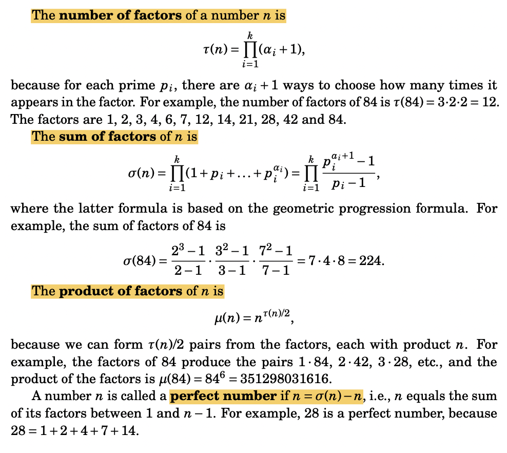
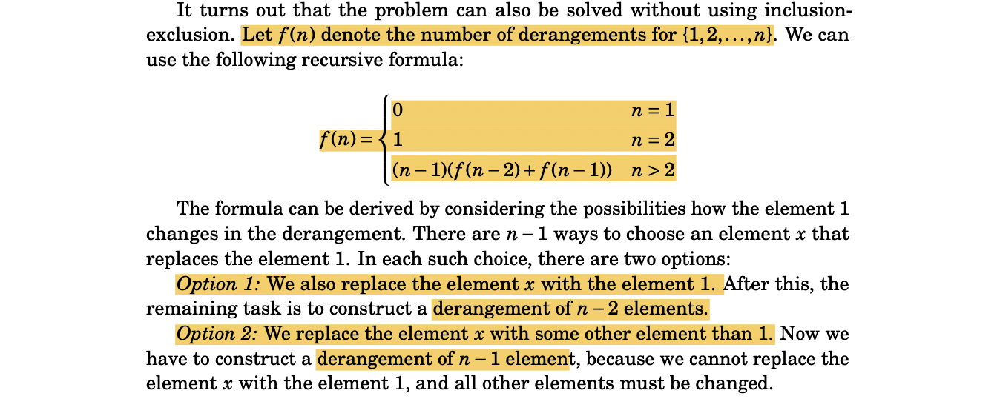

# Maths

## 0.0.1 Calculus Formulae

### **1. Series Expansions**

#### **Taylor Series & **Maclaurin Series

 

### 2. Applications of Maclaurin Series

 .png>)

.png>)

.png>)


### 3. Useful Graphs

.png>)

.png>)

.png>)


### 4. Trigonometric Graphs & Table


## 0.0.2 Other Notes :

### **0.1 Fibonacci:**

* <mark style="color:orange;">**Zeckendorf’s theorem**</mark> states that every positive integer has a **unique representation as a sum of Fibonacci numbers** such that **no two numbers are equal or consecutive Fibonacci numbers**.
  * For example, the number 74 can be represented as the sum 55+13+5+1.
* <mark style="color:orange;">**Binet’s formula**</mark> for calculating **Fibonacci numbers:**


### **0.2 Primes & Factors**





* <mark style="color:orange;">**Lagrange’s theorem**</mark> states that every positive integer can be represented as a sum of four squares, i.e.,  <mark style="color:yellow;"></mark>$$N = a^2 + b^2 + c^2 + d^2$$ <mark style="color:yellow;"></mark>
  * For example, the number 123 can be represented as the sum $$123 = 8^2 + 5^2 + 5^2 + 3^3$$&#x20;

### **0.3 Euclidean GCD**

```python
def gcd(a,b):
    if (b == 0):              # Everything divides 0
         return a
    return gcd(b, a%b)
```

### **0.4 Sieve of Eratosthenes**

* **COMPLEXITY**: <mark style="color:yellow;">**\~O(N)**</mark>




```python
if n <= 1:
    return 0

primes = [True for _ in range(n+1)]    ## True: is prime, False: not a prime
primes[0] = False
primes[1] = False
for i in range(2,int(sqrt(n+1))+1):
    if primes[i]:
        for j in range(i*i,n+1,i):
            primes[j] = False

return sum(x for x in primes if x)
```



### 0.4 Combinatorics

* <mark style="color:orange;">**Catalan numbers**</mark>
  * C(n) equals the number of <mark style="color:yellow;">**valid parenthesis**</mark>** expressions **that consist of n left parentheses and n right parentheses.
  * Catalan numbers are also related to **trees**:
    * there are **C(n)** <mark style="color:yellow;">**binary trees**</mark> of **n nodes**
    * there are **C(n−1)** <mark style="color:yellow;">**rooted trees **</mark>of **n nodes**


* <mark style="color:orange;">**Derangements**</mark>
  * \==> permutations where no element remains in its original place
    * number of derangements of elements {1, 2, . . . , n}, i.e., .
    * For example, when n = 3, there are two derangements: (2, 3, 1) and (3, 1, 2)



### 0.5 Modular Exponentiation :

```cpp
int my_pow(int x,int n,int M){    //get (x^n % M)
    if(n==0) return 1;
    else if(n%2 == 0) return my_pow((x*x)%M,n/2,M);
    else return (x*my_pow((x*x)%M,(n-1)/2,M))%M;
}
// or in python: 
math.pow(x,n,M)
```

###

## 1. Problems: Maths

* [x] LC [326.Power of Three](https://leetcode.com/problems/power-of-three/)
* [x] CSES: [Two Sets](https://cses.fi/problemset/task/1092) | four consecutive numbers can be divided into 2 sets of equal sums | [link to solution approach](https://www.reddit.com/r/learnprogramming/comments/n9ql5a/cses\_problem\_two\_sets/) ⭐️
* [x] CSES: [Coin Piles](https://cses.fi/problemset/task/1754) | [Solution Approach](https://discuss.codechef.com/t/coin-piles-problem-from-cses/28647/3)
* [x] CSES: [Gray Code](https://cses.fi/problemset/task/2205) | [Solution](https://www.geeksforgeeks.org/generate-n-bit-gray-codes/)
* [x] CSES: [Missing Coin Sum](https://cses.fi/problemset/result/2583670/) | [Approach](https://discuss.codechef.com/t/cses-missing-coin-sum/84039/2) ✅
  * KYA SEEKHA: At any index **i** in a sorted array **a**, currSum represents `sum(a[ 0...i ])`.We can form every possible sum from `1...currSum`, when we are at index i
*   [x] LC: [166.Fraction to Recurring Decimal](https://leetcode.com/problems/fraction-to-recurring-decimal/submissions/) ✅| recurring decimal => reminder will repeat | @google&#x20;

    \--->  [Approach](https://leetcode.com/problems/fraction-to-recurring-decimal/discuss/180004/Python-4-lines-\(32ms-beats-100\)-with-explanation)
* [x] LC [1980.Find Unique Binary String](https://leetcode.com/problems/find-unique-binary-string/) | **Cantor's Diagonalization** | [Video@veritassium](https://www.youtube.com/watch?v=OxGsU8oIWjY)
  * Some infinities(Uncountable Infinity- **party bus people**) are BIGGER than other infinities(Countable Infinities- hotel rooms 1...inf)
  * Just watch the video; so fucking mind-blowing
* [x] LC [1363.Largest Multiple of Three](https://leetcode.com/problems/largest-multiple-of-three/) ✅| fucking amazing question & elegant solution 🍪🍪🍪
* [x] [**31. Next Permutation**](https://leetcode.com/problems/next-permutation/)\*\* | ✅| A must | \*\*interview mei aayega toh bina algo jaane, nhi kar paoge
* [ ] LC [166. Fraction to Recurring Decimal](https://leetcode.com/problems/fraction-to-recurring-decimal/) |&#x20;



```python
import math

def isPowerOfThree(self, n: int) -> bool:
    if n <= 0: return False
    return math.log10(n) / math.log10(3) % 1 == 0
```



Firstly notice that any four consecutive natural numbers can be split into two sets with equal sums Example: If my starting number is say x, and I consider 4 consecutive numbers then sum(x, x + 3) = sum(x + 1, x +2).

1. So if n is divisible by 4 you can group them using the above approach by considering the remainders.
2. Suppose n when divided by 4 leaves remainder 3. Even then we should be able to divide into two sets since three numbers (x + 1, x + 2, x + 3) such that x is divisible by 4 contain two additional odd numbers (x + 1, x + 3) (x is even since it is divisible by 4). Another point to notice is that 1+2 = 3 is the only triplet (x, x+1, x+2) such that two elements add up to third. So start with sets A = {1, 2} B = {3}. Since n % 4 = 3, count of remaining numbers is divisible by 4. So now apply the first property that given 4 numbers x, x + 1, x + 2, x + 3, sum of the numbers in the middle is equal to that of those at the extremities.

```python
n = int(input())
'''
n = 12
1 2 3 | 4 5 6 | 7 8 9 | 10 11 12

n = 7
4 5 6 7
[1,2,4,7]
[3,5,6]

'''

if n%4 == 0:
    print('YES')
    a, b = [],[]
    # [1.........................N]
    # |  x |  x+1 |  x+2  |  x+3  |
    # 1    k      2k      3k      4k
    
    # put {x,x+3} in a[] & put {x+1,x+2} in b[]
    k = (n)//4
    print(' k = ',k)
    
    for i in range(1, k+1):
        a.append(i)
    for i in range(3*k + 1, n+1):
        a.append(i)
    
    for i in range(k+1,3*k + 1):
        b.append(i)
        
    print(sorted(a), ' sum = ', sum(a))
    print(sorted(b), ' sum = ', sum(b))
    
elif n%4 == 3:
    print('YES')
    a, b = [], []
    # [1,2,3,4..........................N]
    #        |  x |  x+1 |  x+2  |  x+3  |
    #        4   4+k    4+2k    4+3k    4+4k
    
    # (1+2) = 3
    # put {1,2,x,x+3} in a[] & put {3,x+1,x+2} in b[]
    a.append(1)
    a.append(2)
    b.append(3)
    
    k = (n)//4
    print(' k = ',k)
    
    for i in range(4, k+4):
        a.append(i)
    for i in range(4 + 3*k , n+1):
        a.append(i)
    
    for i in range(k+4,3*k + 4):
        b.append(i)
    print(sorted(a), ' sum = ', sum(a))
    print(sorted(b), ' sum = ', sum(b))
else:
    print('NO')

```



```python
T = int(input())
 
# 1. DP based: O(N**2)==================================== [TLE]
MEMO = {}
 
def f(a,b):
    if a==0 and b == 0:
        MEMO[(a,b)] = True
        return True
 
    if (a,b) in MEMO:
        return MEMO[(a,b)]
    res = False
    #1. a-1, b-2
    if a>=1 and b>=2:
        res = res or f(a-1,b-2)
    #2. a-2, b-1
    if a>=2 and b>=1:
        res = res or f(a-2,b-1)
    MEMO[(a,b)] = res
    return res
 
# 2. Maths based: O(1)==================================== 
for t in range(T):
    a,b = map(int,input().split())
 
    if a<b: 
        a,b = b,a
    
    #1. x must be >=0
    if a > 2*b:
        print("NO")
    #2. x and y must be multiple of 3
    elif (a+b)%3 == 0:
        print("YES")
    else:
        print("NO")
 
'''
Lets say x times we take 2 from a , and 1 from b
and y times we take 2 from b and 1 from a
 
meaning:
a = 2x + 1y
b = 1x + 2y
 
on solving for a and b
 
2a - b = 3x
2b - a = 3y
 
x and y should be non negative , and from here we can derive (a+b)%3==0.
'''
```



#### **Basic Math**

999....999 % 3 == 0\
1000....000 % 3 == 1\
a000....000 % 3 == a % 3\
abcdefghijk % 3 == (a+b+c+..+i+j+k) % 3

#### **Explanation**

1. Calculate the sum of digits `total = sum(A)`
2. If `total % 3 == 0`, we got it directly
3. If `total % 3 == 1` and we have one of 1,4,7 in A:\
   we try to remove one digit of 1,4,7
4. If `total % 3 == 2` and we have one of 2,5,8 in A:\
   we try to remove one digit of 2,5,8
5. If `total % 3 == 2`:\
   we try to remove two digits of 1,4,7
6. If `total % 3 == 1`:\
   we try to remove two digits of 2,5,8
7. Submit

```python
d1 = sorted([i for i in d if i%3 ==1])
d2 = sorted([i for i in d if i%3 ==2])
d3 = [i for i in d if i%3 ==0]
if sum(d) % 3 == 1:
    if len(d1) != 0:
        res = d1[1:] + d2 + d3
    else:
        res = d2[2:]+ d3
elif sum(d) % 3 == 2:
    if len(d2) != 0:
        res = d1 + d2[1:] + d3
    else:
        res = d1[2:] +d3
else:
    res = d
res.sort(reverse = True)
if not res: return ''
return str(int(''.join([str(i) for i in res])))
```



**ALGO:**

* To find next permutations, we'll start from the end
* First we'll find the first non-increasing element starting from the end.
* there will be two cases:
  * **CASE#1: **Our i becomes zero (This will happen if the given array is sorted decreasingly).&#x20;
    * In this case, we'll simply reverse the sequence and will return
  * **CASE#2: **If it's not zero then we'll find the first number greater than nums\[i-1] starting from end
    * And We'll swap these two numbers
    * Then We'll reverse a sequence starting from i to end


```python
def nextPermutation(self, nums: List[int]) -> None:
    # To find next permutations, we'll start from the end
    i = j = len(nums)-1
    # First we'll find the first non-increasing element starting from the end
    while i > 0 and nums[i-1] >= nums[i]:
        i -= 1
    # After completion of the first loop, there will be two cases
    # 1. Our i becomes zero (This will happen if the given array is sorted decreasingly). 
    # In this case, we'll simply reverse the sequence and will return 
    if i == 0:
        nums.reverse()
        return 
    # 2. If it's not zero then we'll find the first number grater then nums[i-1] starting from end
    while nums[j] <= nums[i-1]:
        j -= 1
    # Now out pointer is pointing at two different positions
    # i. first non-assending number from end
    # j. first number greater than nums[i-1]

    # We'll swap these two numbers
    nums[i-1], nums[j] = nums[j], nums[i-1]

    # We'll reverse a sequence strating from i to end
    nums[i:]= nums[len(nums)-1:i-1:-1]
    # We don't need to return anything as we've modified nums in-place
```



## 2. Problems: Combinatorics

* [ ] AtCoder: [Cumulative Sum](https://atcoder.jp/contests/abc208/tasks/abc208\_f) | [Editorial](https://atcoder.jp/contests/abc208/editorial/2219)

## 3. Problems: Chess

* [x] CSES: [Two Knights](https://cses.fi/problemset/task/1072) | approach: [here](https://discuss.codechef.com/t/cses-two-knights-problem-help-needed/69448/5) & [here](https://math.stackexchange.com/questions/3266257/number-of-ways-two-knights-can-be-placed-such-that-they-dont-attack)
* [ ] [https://codeforces.com/blog/entry/78943](https://codeforces.com/blog/entry/78943)


If two knight attack each other then they will be in 2\*\_3 rectangle or 3\*\_2 rectangle.

* number of 2\*3 rects = #rows\*#cols = (n-1)\*(n-2)

So the number of ways of placing them is (n-1)_(n-2)+(n-2)_(n-1). Also in each rectangle no ways of placing the knight is 2. So total ways of placing knight so that they attack each other will be 2\_2\_(n-1)_(n-2). So the number of ways such that knight do not attack each other will be n\_n_(n\_n-1)/2 — 4\_(n-1)\_(n-2)



## 4. Problemsets

* Leetcode tag=**Maths :** [https://leetcode.com/problemset/all/?topicSlugs=math](https://leetcode.com/problemset/all/?topicSlugs=math)
* Hackerrank: [https://www.hackerrank.com/domains/mathematics?filters%5Bsubdomains%5D%5B%5D=geometry](https://www.hackerrank.com/domains/mathematics?filters%5Bsubdomains%5D%5B%5D=geometry)
* Codeforces Tag = **combinatorics/probability**: [https://codeforces.com/problemset?tags=probabilities](https://codeforces.com/problemset?tags=probabilities)
* Codeforces tag = \*\*number-theory: \*\* [https://codeforces.com/problemset?tags=number+theory](https://codeforces.com/problemset?tags=number+theory)

## 5. Resources

* Kartik Arora's Playlist :[ Number Theory](https://www.youtube.com/watch?v=2NN5j1iF2ko\&list=PLb3g\_Z8nEv1i6NHntG5l2fPKuVu853EYy\&ab\_channel=KartikArora)
* \*\*Topcoder \*\*:
  * [**MATHEMATICS FOR TOPCODERS**](https://www.topcoder.com/thrive/articles/Mathematics%20for%20Topcoders)
  * [**BASICS OF COMBINATORICS**](https://www.topcoder.com/thrive/articles/Basics%20of%20Combinatorics)
