# HLD:Questions

## 0.Template

```
* Multiple Instance of each service
* API Gateway(LB+Proxy)
* Zookeeper
* CDN
* Varnish
* Cache(write back)-Redis
* SQL
    * Read replicas
    * sharding(user_id/location)
* NoSQL
    * Replicas/Distributed
* Kafka/worker
* Stateless Microservices
* Hystrix
* HDFS/S3
* local cache : last 50 msgs
```

```
#1. Requirement Gathering ======================================
        1.1 Functional Requirements
        1.2 NonFunctional Requirements - Usage Patterns(read heavy/CAP tradeoffs)
        1.3 Out of Scope
#2. Back-of-the-envelope estimation ============================
        2.1 Scale of System
        2.2 Storage size estimation
        2.3 Bandwidth esitmation(read+write)
#3. APIs =======================================================
        GET  /name/:id      Req:{}, Res:{}
        POST /name/:id      Req:{} 
#4. Models:Classes, DB Schema & ER diagrams=====================
        * Tables
        
        * DBs & choice(NoSQL/SQL)
#5. Draw 'Basic HLD'=============================================
#6. EVOLVE & 'Draw Detailed HLD' with the discussion on each comp =====
#7. Walk down flow of every action =============================
#7. Identifying and resolving bottlenecks ======================
```

#### #1. Requirement Gathering ======================================

#### 1.1 Functional Requirements

*

#### 1.2 NonFunctional Requirements - Usage Patterns(read heavy/CAP tradeoffs)

*

#### 1.3 Out of Scope

*

#### #2. Back-of-the-envelope estimation ============================

#### 2.1 Scale of System

*

#### 2.2 Storage size estimation

*

#### 2.3 Bandwidth estimation(read+write)

*

#### #3. APIs =======================================================

*

#### #4. Models:Classes, DB Schema & ER diagrams=====================

#### 4.1 Tables Schemas

*

#### 4.2 DBs choices(NoSQL/SQL)

*

#### #5. Draw 'Basic HLD'=============================================

#### #6. Detailed HLD ================================================

## 1.Instagram

* Whimiscal [Board Link](https://whimsical.com/instagram-TofiB1JrEPSiGg9tHkXTgN)


```
#1. Requirement Gathering ======================================
        
        * Functional Requirements:
                1. Users can create account
                2. Users can make posts(photos/text)
                3. Users can follow other users
                4. Users can like+comment on others/self' posts
                        *[?] Comment on a comment? => how many recursion levels(1?)
                        *[?] like a comment?  
                5. Timeline of all those whom user follow
        
        * Non-functional Requirements:
                1. Service is hightly available
                2. The acceptable latency of the system is 200ms for News Feed generation.
                3. Consistency can take a hit (in the interest of availability), 
                        if a user doesn’t see a photo for a while; it should be fine.
                4. The system should be highly reliable; any uploaded photo or video should never be lost.
        
        * Out of Scope:
                * Notifications?
                        * Push notifications => normal user
                        * Celebrity ===> PULL Notifications  
                * Adding tags to photos
                * searching photos on tags
                * commenting on photos
                * tagging users to photos
                * follow recommendation
        
        
#2. Back-of-the-envelope estimation ============================
        2.1 Scale of System
                * Total Userbase    : 500M
                * Daily Active Users: 1M
                * 2 new photos per user day => 2M new photos per day
        
        2.2 Storage size estimation
                * size of 1 photo = 5MB
                 => Space required per day : 2M*5MB  = 10 TB
                 => Total space required for 10 years = (10 TB )(365)(10) = 36.5 PB
                                                                          ~ 40 PB (accounting dec in camera price)
                
        2.3 CAP Tradeoffs
                * System is read heavy
                * Users can upload as many photos as they want 
                        => Storage management is crucial
                * Low latency is expected while viewing photos
                * Data should be 100% reliable. 
                        If a user uploads a photo, the system will guarantee that it will never be lost.


#3. APIs =======================================================
        1. POST /user/:id :: {userData}      
        2. GET /user/:id 
        3. POST /follow/:followeeID
        4. POST /like/:postID
        5. POST /comment/:parentID
        6. GET  /getFeed
                * Feed Generation Service PRECOMPUTES user's feed "hourly" & stores in cache
                        * Based On:
                        * GET /getUsersFollowedBuy/:userID    => set<userID> 
                        * then-> GET /getPostsByUser/:userID  => set<postID> # N-latest posts by each
        
        
#4. Models : Defining Classes & ER Diagrams======================
        1. User
        2. Post
                * postID(PK,UUID)
                * text
                * imangeUrl
                * timestamp
                * userId
        3. Like
                * likeId(PK, UUID)
                * parentId (could be postId or commentId)
                * parentType (comment/post)
                * userId
                * timestamp
        4. Comment
                * commentID(PK, uuid)
                * text
                * timestamp
                * userId
        5. Follow
                * followerID
                * followeeID
                * timestamp
#5. Draw Basic HLD =============================================
#6. EVOLVE HLD to scale & indepth discussion of components =====
#7. Identifying and resolving bottlenecks ======================
```


## 2. Parking Lot

* Whimsical Board: [link](https://whimsical.com/parking-lot-9Jq2YZsmfcmUpRbkSgFSr7)
* Code: `/Users/aayush/Sandbox/llds/ParkingLot`

```
#1. Requirement Gathering ======================================
        1.1 Functional Requirements
                * Reserve a parking spot
                * Receive a ticket/receipt
                * Make payment
                * 3 Types of parking spots: Compact, Regular, large
                * Flat pricing for each spot, per hour 
        1.2 NonFunctional Requirements 
                * High consistency (no 2 people should reserve same spot)
                        * Go for Strong Consistency (rather than Eventual Consitency)
                        * Hence RDBMS (ACID transactions)
                * Reads >>> Writes
        1.3 Out of Scope
                * In-house payment system
#2. Back-of-the-envelope estimation ============================
        2.1 Scale of System
                * 10 floors per garage, 200 spots per floors => 2000 spots
                        * => Not applicable for big data
        2.2 Storage size estimation
#3. APIs =======================================================
        3.1 External Endpoints:
                * POST /create_account
                        * Params: email, pwd(hashed), name, (3rd party login)
                * POST /reserve
                        * Params: garage_id, start_time, end_time
                        * Returns: reservation_id, spot_id
                * /payment => 3-rd party
                        * Params: reservation_id
                        * [?] to be called internally by /reserve
                * POST /cancel
                        * Params: reservation_id
        3.2 Internal Endpoints:
                * /calculate_payment/:reservation_id
                * /check_free_spots
                        * Has logic if smaller vehicles can fit into one large spot
                * /allocate_spot
                        * Params: garage_id, vehicle_type, time

#4. Models : Classes, DB Schema & ER diagrams=====================
        * Reservations
                * id : PK, serial
                * garage_id: FK, int
                * spot_id: FK, int
                * start: int
                * end: int
                * paid: boolean
        * Garage
                * id: PK, serial
                * zipcode: varchar
                * rate_compact: decimal
                * rate_regular: decimal
                * rate_large: decimal
        * Spots
                * id: PK, serial
                * garage_id: FK, int
                * vehicle_type: ENUM
                * status: ENUM
        * Users
                * id: PK, serial
                * email: varchar
                * password: varchar(NOTE: this is probably SHA-256 hashed)
                * name: varchar
        * Vehicles
                * id: PK, serial
                * user_id: FK, int
                * license: varchar
                * vehicle_type: ENUM

#5. Draw Basic HLD =============================================
#6. EVOLVE HLD to scale & indepth discussion of components =====
#7. Walk down flow of every action =============================
#7. Identifying and resolving bottlenecks ======================
```

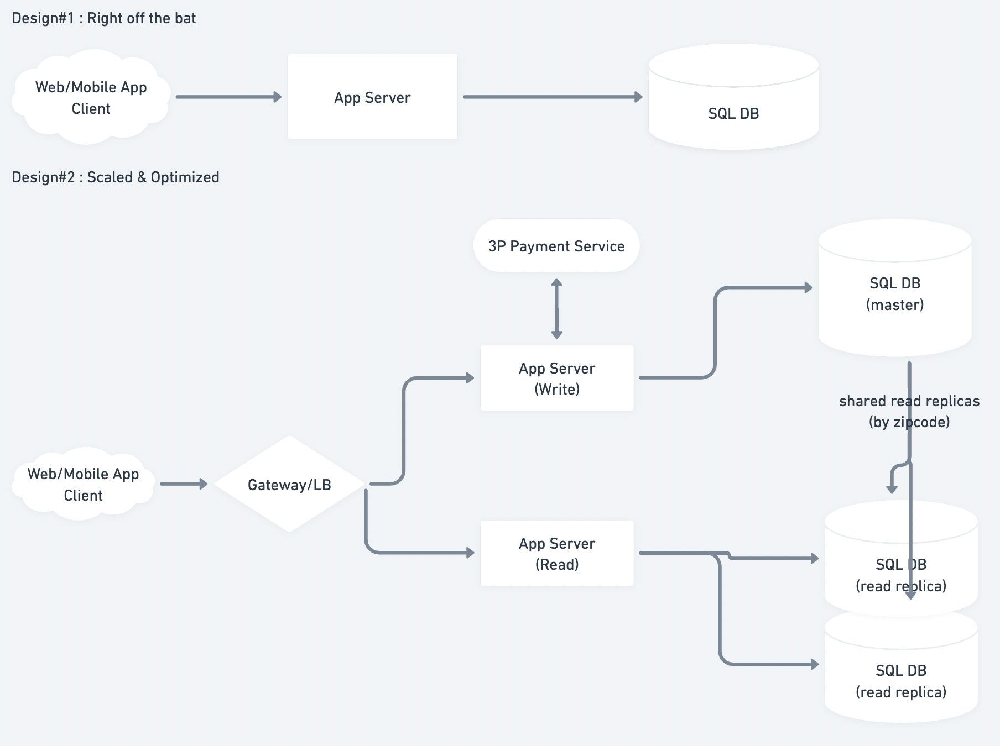

## 3. \~TinyURL

* Whimsical board: [link](https://whimsical.com/tinyurl-XRrbRGZFccA2bhgqDBsRGp)
* Amazing similar read: HN: [How does Google Authenticator work?](https://prezu.ca/post/2021-07-30-totp-1/) 🤯

```
#1. Requirement Gathering ======================================
        1.1 Functional Requirements
                * customer Login
                * Given a URL; generte a shorter & unique alias of it: www.short.ly/abc123
                        * [?] length of short url
                * Expiry/TTL for each short URL                        
                * getLongUrl(short_url)
                
        1.2 NonFunctional Requirements - Usage Patterns(read heavy/CAP tradeoffs)
                * High Availability (for reads to work)
                * High consistency (to avoid duplicate writes)
                * Short ULR should be unique
        1.3 Out of Scope
                * customized short url
                * analytics
                * API support

#2. Back-of-the-envelope estimation ============================

        2.1 Scale of System
                * New URLs per month(write) = 500 M
                * QPS = 500M/(30*24*60*60) = 200 URLS write per second
                * Read:Write = 100:1
                        => #urls read per month = 500M*100 = 50B
        2.2 Storage size estimation
                * store all ursl for 5 years
                        * => Total urls stored in 5 year = 500M*5*12 = 30B
                * size of single stored obj = 500bit
                        * => total storage reqd = 30B * 500 bit = 15 TB
                * CACHING:
                        * assume 80-20 rule:
                                * i.e. 20% of URLs generate 80% of traffic
                                * cache these 20% hot URLs
                                * cache size per second = 20K*(500bit) = 10MB
                                * => cache size per day = 10MB*24*3600 = 100GB
        2.3 Bandwidth Estimate
                * Incoming(write) req = 200 * 500 bytes = 100 KB/s
                * Outgoing(read) req  = 20K * 500 bytes = 10 MB/s 
                
#3. APIs =======================================================
        * createURL(api_dev_key, original_url, custom_alias=None, user_id=None, expire_date=None)
                * returns short URL string
        * getLongURL(api_dev_key, short_url,user_id) 
                * returns original LONG url string
        * deleteURL(api_dev_key, short_url)
        
        * NOTE: how to prevent abuse: 
                To prevent abuse, we can limit users via their api_dev_key
                
#4. Models:Classes, DB Schema & ER diagrams=====================
        * URL
                * short_url : PK, varchar
                * original_url : varchar
                * createdOn : datetime
                * expiresOn : datetime
                * createdBy : user_id, FK
        * User
                * user_id : PK, varchar
                * name: varchar
                * email: varchar
                * password: varchar (hashed)
                * createdOn : datetime
                * last_login: datetime
                
#5. Draw Basic HLD =============================================

* Encoding Algos
        1. base36 ([a-z ,0-9]) 
        2. base62 ([A-Z, a-z, 0-9]) 
        3. Base64 (if we add ‘+’ and ‘/’)
        4. MD5/ SHA256
* [?]what should be the length of the short key? 6, 8, or 10 characters?
        * Using base64 encoding, a 6 letters long key would result in 64^6 = ~68.7 billion possible strings
        * Using base64 encoding, an 8 letters long key would result in 64^8 = ~281 trillion possible strings
        * ASSUME(len = 6) With 68.7B unique strings, let’s assume six letter keys would suffice for our system.

* MD5 algorithm as our hash function, it’ll produce a 128-bit hash value.
* After base64 encoding, we’ll get a string having more than 21 characters 
        *(since each base64 character encodes 6 bits of the hash value). 
* Now we only have space for 8 characters per short key, how will we choose our key then? 
        * We can take the first 6 (or 8) letters for the key. This could result in key duplication, to resolve that, we can choose some other characters out of the encoding string or swap some characters.


# How to avoid duplicate entries(by multiple server instances)
        1. Keep generating urls until its unique
        2. Append a unique key to url before encoding it
                * Unique key could be:
                        1. UserID (if exists)
                        2. increasing Counter per machine
        2.1 ISSUE: how do you manage counters on individual machine: overflow/machine failure/addition
                * => Use zookeeper
                        * a centralized service for providing configuration information, naming, synchronization and group services over large clusters in distributed systems. 
                        * The goal is to make these systems easier to manage with improved, more reliable propagation of changes
                        
# Cleaup Util        
```


## 4. BookMyShow

* Whimisical Board [link](https://whimsical.com/bookmyshow-SiSmppUMB3mrGzyr8YFyY5)



````
# 1. Requirement Gathering ======================================
        1.1 Functional Requirements
            
            * Other sevices(like Paytm) can also book seats in same hall
            * Show multiple cities
            * Each theater can have multiple halls
            * Each hall can run 1 movie at 1 time
            * Movies will have multiple shows
            * Customers can search movie by title, language, genre, release date, city.
                => Redirect search reqs to Elastic Search
                * It also works as Analytics Engine
            * Customers can see the theaters as per their filtered search
            * Customers can see seating arrangement of halls & select any city they want
            * Customers can see booked/free tickets
            * Payments - 3P
            * Show movie info
            * Ensure No two customers can reserve the same seat.

        1.2 NonFunctional Requirements - Usage Patterns(read heavy/CAP tradeoffs)
            
            * Highly Concurrent
            
        1.3 Out of Scope

            * Moive suggestions
            * Give Reviews, Ratings
            * Send ticket my sms/whatsapp/mail
            * Add discount coupon during payment
# 2. Back-of-the-envelope estimation ============================
        2.1 Scale of System
        2.2 Storage size estimation
# 3. APIs =======================================================
# 4. Models:Classes, DB Schema & ER diagrams=====================

# Notes: ==================================================== 

* Lock mechanism on seat booking:
    * If he doesn’t book within 10 min, release the seat.

* For Search Queries:
    => Redirect search reqs to Elastic Search
    * It also works as Analytics Engine

* For caching use: Redis or memcached
    * Redis is better choice as its distributed & persistent

* Choice of DB: 
    => use both RDBMS + NoSQL
    * RDMBS: store ACID/static data:
        * movie halls
        * seats
        * cities
        * userInfo
        * => Sharding
        * => Master/Slave for Read/Writes
    * NoSQL : 
        below data is Big data i.e. too much for RDBMS to digest
        so use NoSQL for it
        * movie related info-cast/story/reviews etc
        * => Geo-distributed backups

* Use Kafka queues to send tickets on mail/sms/generate pdfs in ASYNC

* For Recommendation system:
    * Dump all data on HDFS
    * Process with Apache Spark
    * Run Hive queries
    * Build ML models & recommend

* For concurrency:

```s
SET TRANSACTION ISOLATION LEVEL SERIALIZABLE;
 
BEGIN TRANSACTION;
 
    -- Suppose we intend to reserve three seats (IDs: 54, 55, 56) for ShowID=99 
    Select * From ShowSeat where ShowID=99 && ShowSeatID in (54, 55, 56) && isReserved=0 
 
    -- if the number of rows returned by the above statement is NOT three, we can return failure to the user.
    update ShowSeat table...
    update Booking table ...
 
COMMIT TRANSACTION;
```
````



```python
from enum import Enum


class BookingStatus(Enum):
    REQUESTED, PENDING, CONFIRMED, CHECKED_IN, CANCELED, ABANDONED = 1, 2, 3, 4, 5, 6


class SeatType(Enum):
    REGULAR, PREMIUM, ACCESSIBLE, SHIPPED, EMERGENCY_EXIT, OTHER = 1, 2, 3, 4, 5, 6


class AccountStatus(Enum):
    ACTIVE, BLOCKED, BANNED, COMPROMISED, ARCHIVED, UNKNOWN = 1, 2, 3, 4, 5, 6


class PaymentStatus(Enum):
    UNPAID, PENDING, COMPLETED, FILLED, DECLINED, CANCELLED, ABANDONED, SETTLING, SETTLED, REFUNDED = 1, 2, 3, 4, 5, 6, 7, 8, 9, 10

#------------------------------------

from abc import ABC

# For simplicity, we are not defining getter and setter functions. The reader can
# assume that all class attributes are private and accessed through their respective
# public getter methods and modified only through their public methods function.


class Account:
    def __init__(self, id, password, status=AccountStatus.Active):
        self.__id = id
        self.__password = password
        self.__status = status

    def reset_password(self):
        None


# from abc import ABC, abstractmethod
class Person(ABC):
    def __init__(self, name, address, email, phone, account):
        self.__name = name
        self.__address = address
        self.__email = email
        self.__phone = phone
        self.__account = account


class Customer(Person):
    def make_booking(self, booking):
        None

    def get_bookings(self):
        None


class Admin(Person):
    def add_movie(self, movie):
        None

    def add_show(self, show):
        None

    def block_user(self, customer):
        None


class FrontDeskOfficer(Person):
    def create_booking(self, booking):
        None


class Guest:
    def register_account(self):
        None

#------------------------------------

from datetime import datetime


class Show:
    def __init__(self, id, played_at, movie, start_time, end_time):
        self.__show_id = id
        self.__created_on = datetime.date.today()
        self.__start_time = start_time
        self.__end_time = end_time
        self.__played_at = played_at
        self.__movie = movie


class Movie:
    def __init__(self, title, description, duration_in_mins, language, release_date, country, genre, added_by):
        self.__title = title
        self.__description = description
        self.__duration_in_mins = duration_in_mins
        self.__language = language
        self.__release_date = release_date
        self.__country = country
        self.__genre = genre
        self.__movie_added_by = added_by

        self.__shows = []

    def get_shows(self):
        None
#----------------------------

class Address:
    def __init__(self, street, city, state, zip_code, country):
        self.__street_address = street
        self.__city = city
        self.__state = state
        self.__zip_code = zip_code
        self.__country = country
        

class City:
    def __init__(self, name, state, zip_code):
        self.__name = name
        self.__state = state
        self.__zip_code = zip_code


class Cinema:
    def __init__(self, name, total_cinema_halls, address, halls):
        self.__name = name
        self.__total_cinema_halls = total_cinema_halls
        self.__location = address

        self.__halls = halls


class CinemaHall:
    def __init__(self, name, total_seats, seats, shows):
        self.__name = name
        self.__total_seats = total_seats

        self.__seats = seats
        self.__shows = shows


class CinemaHallSeat:
    def __init__(self, id, seat_type):
        self.__hall_seat_id = id
        self.__seat_type = seat_type

#------------------------------------

class Booking:
    def __init__(self, booking_number, number_of_seats, status, show, show_seats, payment):
        self.__booking_number = booking_number
        self.__number_of_seats = number_of_seats
        self.__created_on = datetime.date.today()
        self.__status = status
        self.__show = show
        self.__seats = show_seats
        self.__payment = payment

    def make_payment(self, payment):
        None

    def cancel(self):
        None

    def assign_seats(self, seats):
        None


class ShowSeat(CinemaHallSeat):
    def __init__(self, id, is_reserved, price):
        self.__show_seat_id = id
        self.__is_reserved = is_reserved
        self.__price = price


class Payment:
    def __init__(self, amount, transaction_id, payment_status):
        self.__amount = amount
        self.__created_on = datetime.date.today()
        self.__transaction_id = transaction_id
        self.__status = payment_status
#--------------------------------------
from abc import ABC

class Search(ABC):
    def search_by_title(self, title):
        None

    def search_by_language(self, language):
        None

    def search_by_genre(self, genre):
        None

    def search_by_release_date(self, rel_date):
        None

    def search_by_city(self, city_name):
        None


class Catalog(Search):
    def __init__(self):
        self.__movie_titles = {}
        self.__movie_languages = {}
        self.__movie_genres = {}
        self.__movie_release_dates = {}
        self.__movie_cities = {}

        def search_by_title(self, title):
            return self.__movie_titles.get(title)

        def search_by_language(self, language):
            return self.__movie_languages.get(language)

        # ...

        def search_by_city(self, city_name):
            return self.__movie_cities.get(city_name)
```



```python
global f
f = 0
 
#this t_movie function is used to select movie name
def t_movie():
    global f
    f = f+1
    print("which movie do you want to watch?")
    print("1,movie 1 ")
    print("2,movie 2 ")
    print("3,movie 3")
    print("4,back")
    movie = int(input("choose your movie: "))
    if movie == 4:
      # in this it goes to center function and from center it goes to movie function and it comes back here and then go to theater
      center()
      theater()
      return 0
    if f == 1:
      theater()
 
# this theater function used to select screen
def theater():
    print("which screen do you want to watch movie: ")
    print("1,SCREEN 1")
    print("2,SCREEN 2")
    print("3,SCREEN 3")
    a = int(input("choose your screen: "))
    ticket = int(input("number of ticket do you want?: "))
    timing(a)
 
# this timing function used to select timing for movie
def timing(a):
    time1 = {
        "1": "10.00-1.00",
        "2": "1.10-4.10",
        "3": "4.20-7.20",
        "4": "7.30-10.30"
    }
    time2 = {
        "1": "10.15-1.15",
        "2": "1.25-4.25",
        "3": "4.35-7.35",
        "4": "7.45-10.45"
    }
    time3 = {
        "1": "10.30-1.30",
        "2": "1.40-4.40",
        "3": "4.50-7.50",
        "4": "8.00-10.45"
    }
    if a == 1:
        print("choose your time:")
        print(time1)
        t = input("select your time:")
        x = time1[t]
        print("successfull!, enjoy movie at "+x)
    elif a == 2:
        print("choose your time:")
        print(time2)
        t = input("select your time:")
        x = time2[t]
        print("successfull!, enjoy movie at "+x)
    elif a == 3:
        print("choose your time:")
        print(time3)
        t = input("select your time:")
        x = time3[t]
        print("successfull!, enjoy movie at "+x)
    return 0
 
 
def movie(theater):
    if theater == 1:
        t_movie()
    elif theater == 2:
        t_movie()
    elif theater == 3:
        t_movie()
    elif theater == 4:
        city()
    else:
        print("wrong choice")
 
 
def center():
    print("which theater do you wish to see movie? ")
    print("1,Inox")
    print("2,Icon")
    print("3,pvp")
    print("4,back")
    a = int(input("choose your option: "))
    movie(a)
    return 0
 
# this function is used to select city
def city():
    print("Hi welcome to movie ticket booking: ")
    print("where you want to watch movie?:")
    print("1,city 1")
    print("2,city 2 ")
    print("3,city 3 ")
    place = int(input("choose your option: "))
    if place == 1:
      center()
    elif place == 2:
      center()
    elif place == 3:
      center()
    else:
      print("wrong choice")
 
 
city() # it calls the function city
```




## 4. Netflix/Youtube

* Whimsical Board [link](https://whimsical.com/netflix-FeHCqLHW73v8wVuAD5r8T4)
* Source: [article+video](https://www.youtube.com/watch?v=psQzyFfsUGU\&ab\_channel=TechDummiesNarendraL)

```
#1. Requirement Gathering ======================================

        1.1 Functional Requirements
                * upload videos.
                * view videos.
                * perform searches based on video titles.
                * record stats of videos, e.g., likes/dislikes, total number of views, etc.
                * add and view comments on videos.
                
        1.2 NonFunctional Requirements 
                * Highly reliable, no uploaded video should be lost
                * Service should be highly available
                * Consistency can take a hit
                * Real time UX; no lag 
                
        1.3 Out of Scope
                * Video recommendation
                * most popular videos
                * channels
                * subscriptions
                * watch later
                * favorites
                
#2. Back-of-the-envelope estimation ============================
        2.1 Scale of System
                * Total users: 5B
                * Daily active users: 1 B
                * 1 User views 5 videos per day
                        => total_views_per_second = 1M*5/(24*2600) = 60K videos/sec
                * Ratio upload:view = 500:1
                        => total_uploads_per_second = 120 videos/sec 
        
        2.2 Storage size estimation
                * size of 1 minute video(including all formats) = 50MB
                        => upload_size_per_day = 50MB*120*3600*24 = 500TB
                
#3. APIs =======================================================
        * uploadVideo(api_dev_key, video_title, vide_description, tags[], category_id, default_language, recording_details, video_contents)
                => Returns HTTP 202(request accepted)
                        -> from Kafka/queue
                * Once video is uploaded; user will get an email
        * searchVideo(api_dev_key, search_query, user_location, maximum_videos_to_return, page_token)
                => Returns JSON of videos_list:
                         * video title
                         * a thumbnail
                         * video creation date
                         * view count
                         
        * streamVideo(api_dev_key, video_id, offset, codec, resolution)
                => Returns A media stream (a video chunk) from the given offset
                
#4. Models:Classes, DB Schema & ER diagrams=====================
#5. Draw Basic HLD =============================================
#6. EVOLVE HLD to scale & indepth discussion of components =====
```

#### Notes on some components:

* **Netflix's Cloud:**
  * Netflix operates in two clouds: **AWS and Open Connect.**
  * Both clouds must work together seamlessly to deliver endless hours of customer-pleasing video.
  * All video related things are handled by **Open Connect.**
  * Anything that doesn’t involve serving video is handled in **AWS**
    * login/billing/search/recommendation

1. **Client**
   * lots of platforms
   * mobile
   * webapp
   * tv
   * xbox
   * \=> built using **ReactJS** - fast as **virtual DOM**
2. **CDN** => **OpenConnect:**
   * Netflix's own CDN
   * they've placed lots of servers in every part of world- to play videos better
   * Region-wise movie collection:
     * Bollywood vs South indian movies
3. ELB : **Amazon's ELB**
   * has 2 tier LB:
   * ELB’s are setup such that load is balanced across **zones** first, then **instances**
4. **New Movie/Video Onboarding Service**(microservice)
   * Before this movie is made available to users, Netflix must convert the video into a format that works best for your device. This process is called\*\* transcoding or encoding.\*\*
   * **Transcoding/Encoding**
     * \*\*=> \*\*process that converts a video file from one format to another, to make videos viewable across different platforms and devices.
     * \*\*Why do we need it? \*\*why not just play the original video
       * device compatability resolution
       * internet speed
       * Pricing plan
   * NOTE: Netflix supports 2200 different devices
   * Netflix has 100-1000 versions of each movie
   * After transcoding, each format is \*\*pushed \*\*to all of the **OpenConnect CDNs**(for users to **start streaming**)
5. \*\*ZUUL \*\*
   * intermediary network of servers to filter incoming/outgoing req & responses
   * i.e. req/response sanitation
   * Also used for beta testing / canary testing
6. **Hystrix:**
   * \=> Hystrix is a\*\* latency and fault tolerance library\*\* designed to isolate points of access to remote systems, services and 3rd party libraries
   * Advantages:
     * Stop cascading failures i.e. reject the request if it cant be handled
     * Realtime **monitoring** of configurations changes
     * Concurrency aware request caching
     * Automated batching through request collapsing
   * IE. If a micro service is failing then return the default response and wait until it recovers.
7. **Microservices:**
   * How to scale:
     * \*\*Isolation of critical endpoints: \*\*decouple critical microservicess to make them independent
     * \*\*Stateless: \*\*These services are designed such that any service instance can serve any request in a timely fashion and so if a server fails it’s not a big deal.
     * \*\*In the failure case \*\*requests can be routed to another service instance and we can automatically spin up a new node to replace it.
8. **SSDs for Caching**
   * Storing large amounts of data in volatile memory\*\* (RAM) is expensive\*\*.
   * Modern disk technologies based on [SSD](https://en.wikipedia.org/wiki/Solid-state\_drive) are providing **fast access** to data but at a **much lower cost when compared to RAM**.
   * Hence, we wanted to move part of the data out of memory without sacrificing availability or performance.
   * The cost to store 1 TB of data on SSD is much lower than storing the same amount in RAM.
9. **Databases:**
   1. **SQL (EC2)**
      * used for all \*\*ACID \*\*transactions: like Billing
   2. **NoSQL (Cassandra) : distributed**
      * user viewing history
      * read >> write => so Netflix had modified Cassandra
10. **Kafka Analytics**
    * Viewing History
    * UI Activity
    * Analytics
    * Recommendation, ML Models\\

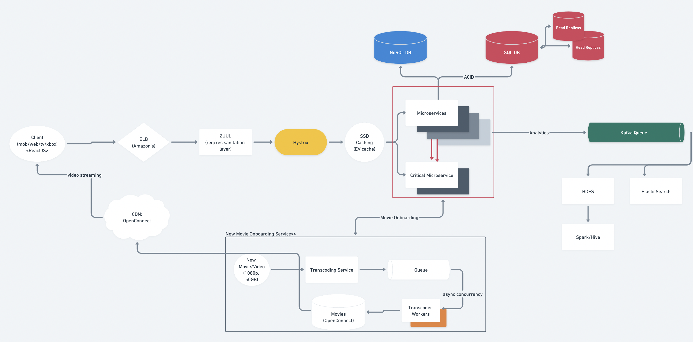

## 5. Ketto/Go Fund Me

* Whimsical: [link](https://whimsical.com/ketto-2S14YgGQ5Er7SLUPxdep5g)
* Source: [LC](https://leetcode.com/discuss/interview-question/system-design/1397022/Go-Fund-me-System-design)

```
#1. Requirement Gathering ======================================
        1.1 Functional Requirements

            * Registered users can create campaigns to fund their cause.
            * Registered users can view a campaign by campaign ID
            * Registered users can collect money against a campaign
            * Registered users could contribute to a campaign based on campaign ID
            * Once a day we flush the collected money into the creator’s account

        1.2 NonFunctional Requirements - Usage Patterns/Tradeoffs

            * Low latency
            * Durability changes made to the campaigns or newly created campaign should not be lost
            * Eventual consistency
            * It is a growing system

        1.3 Out of Scope
            * User registration
            * Analytics
            * Recommendation
            * Search
            * Guest flow

#2. Back-of-the-envelope estimation ============================
        2.1 Scale of System
            * Total Active users: 50M
            * New users added daily: 50K (as 'growing system')
            * CAMPAIGN CREATION:
                1 user creates 5 campaigns => 5*50 => 250M campaigns
            * CAMPAIGN VIEWING:
                5M view capaigns daily => 5M/(24*3600) => 60 cmps/sec
            * => Hence, Load on the system isnt much

        2.2 Storage size estimation
            * SKIPPED (nothing much of storage here)

#3. APIs =======================================================
        * createCampaign(userId, String campaignName, CampaignDetails campaignDetails) 
            → returns campaignId of the created campaign

        * getCampaignDetails(userId, campaignId) 
            → Returns CamapignDetails of the given camapignId

        * pay(userId, CampaignId, PaymentDetails paymentDetails) 
            → return a boolean if the payment was successful or not also updates the total collected amount against the campaign

#4. Models:Classes, DB Schema & ER diagrams=====================
    * SKIPPED

#5. Draw Basic HLD =============================================
    * Campaign Creator Service
    * Campaign Viewer Service

#6. EVOLVE HLD to scale & indepth discussion of components =====
    Add/disucss on these optimisations:
    * Load balancer - which is entry point to our website
    * Gateway -- which would be responsible for filtering requests and authentication and authorization
    * Service discovery --- Would be responsible for providing service end points to internal services and also load balancing internally
    * Caching
    
```


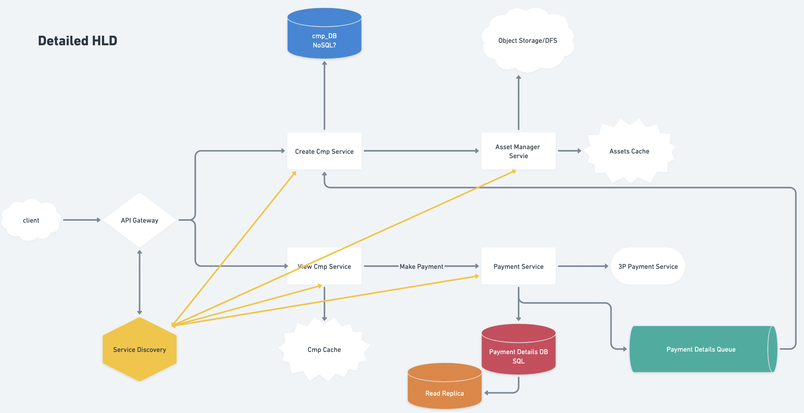

## 6. Twitter

* Whimsical Board [link](https://whimsical.com/twitter-63T4oateDAL6ZdsaJ5LdHT)
* Video [link](https://www.youtube.com/watch?v=wYk0xPP\_P\_8\&ab\_channel=TechDummiesNarendraL)

#### #1. Requirement Gathering =============================================

* **1.1 Functional Requirements**
  * tweet
    * text
    * photo
    * video
  * **trends**
    * see all the tending topics/hastags
  * follow others
  * timeline
    * home timeline(whom user follows)
    * user timeline(user history)
    * search timeline(all tweets as per searched keyword)
* **1.2 NonFunctional Requirements** - Usage Patterns(read heavy/CAP tradeoffs)
  * Highly available
  * Acceptable latency for timeline generation
  * Consistency can take a hit:
    * if a user doesn’t see a tweet for a while, it should be fine.
    * \*\*Eventual Consistency \*\*
  * User traffic will be distributed unevenly throughout the day
* **1.3 Out of Scope**
  * replying on tweets
  * tweet notification
  * suggestion - whom to follow
  * user tagging

#### #2. Back-of-the-envelope estimation =========================================

* **2.1 Scale of System**
  * Daily Active Users(DAU) : 200M
  * write: 2 tweets per user per day
    * \=> daily writes = 2\*200M = 400M/day
  * read:write = 1000:1
    * \=> daily reads = 400B/day
    * system is read-heavy
* **2.2 Storage size estimation**
  * **Text**: 140 chars a tweet
    * 2 bytes to store 1 char (w/o any compression)
    * \+30 bytes for tweet metadata(timestamp, location, userID)
    * \=> 400M\*(280b+30b) = 120GB/day
  * **photo**: 1 in 5 tweets has a photo
    * size of 1 photo = 200KB
    * \=> 400M\*200KB/5 = 400M\*40KB = 16MB\*M = 16TB
  * **video**: 1 in 10 tweets has a video
    * size of 1 video = 2MB
    * \=> 400M\*2MB/10 = 80TB
  * **=> Total daily storage reqd** = 120GB + 16TB + 80TB
    * \= 96.12 TB/day
    * \=> 1.11 GB/sec
* **2.3 Bandwidth estimation**
  * view tweets:
    * **text**:
      * \=> text: 28B\*280b = 7840GB/day = **90MB/sec**
    * user see all the **photos** of every tweet
      * \=> 28B/5\*200KB = 13GB/s
    * user plays 1 in every 3 **videos** of tweet
      * \=> (28B/10/3)\*2MB = 22GB/s
    * **=> total** = 35Gb/s

#### #3. APIs =======================================================

* **tweet**(api\_dev\_key, tweet\_data, tweet\_location, user\_location, media\_ids)
  * \=> returns tweet url to view
* **search**(api\_dev\_key, search\_terms, maximum\_results\_to\_return, sort, page\_token)
  * \=> JSON containing information about a list of tweets

#### #4. Table Schemas & DB Choices=====================

* **Tables:**
  * **User**
    * userID : PK, int
    * name
    * email
    * pwd(hashed)
    * 3rd party login OAuth
    * last login
  * **Tweet**
    * tweetID: PK,int
    * userID
    * text
    * createdAt(ts)
    * locationCordinates
    * mediaAddress
  * **Follower**
    * followerID : FK
    * followeeID : FK
    * timestamp
* **Relations:**
  * 1-Many in User ---- Tweet
  * 1-Many in User ---- Follower
* \[?] Retweets:
* are to be considered a unique tweet & store in 'Tweet' table itself
* **DB choice:**
  * photos+vidoes => DFS
    * HDFS/S3
    * can be queued
  * User, Tweet, Follower tables => NoSQL
    * Distributed NoSQL
    * \=> RDBMS, though good for relations here wont be scalable enough
  * Relationship b/w tables: use\*\* key-value DB \*\*i.e. **Redis✅**
    * `<userID> -> [tweetIDs]`
    * `<userID> -> [followerIDs]`

#### #5. Draw 'Basic HLD'=============================================


#### #6. EVOLVE & 'Draw Detailed HLD' with the discussion on each comp =====

1. \*\* How User Timeline is generated?\*\*
   * Go to Redis table#1 : \<userID> -> \[tweetIDs]
   * SCALING UP: **cache**
2. **How to generate Home Timeline**
   * **Steps using Join**
     * get all followers of the user
     * get their latest tweets
     * merge, sort & display
   * **SCALING UP:**
   * ❌Shard/NoSQL/multiple nodes => wont be as fast as twitter
   * ✅ use "**Fanout**"
   * **Fanout**
     * Fanout => when a new tweet is generated; process it & DISTRIBUTE it to user timelines
     * **WORKING**:
       1. user makes a new tweet
       2. Store it in Tweets table
       3. Push this tweet into his 'User Timeline'
       4. Fan-out this tweet into 'Home Timeline' of ALL his followers
     * Hence; no DB query is required!!!
     * **NOTE**: Do not do this precomputation for **'Passive users'**


```
3\. **How to handle celebrity tweets?**
```

* celebrity has MILLIONS of followers
*   **WORKING:**

    * **Celebrity side:**
      1. celebrity makes a tweet
      2. Store it in his Tweets table
      3. Push it to his 'User Timeline'
      4. **DO NOT FAN OUT**
    * **Fan Side:**
    * Every fan has a list of celebrities he follows
    * When the fan opens his 'Home Timeline':
      * Go to all the celebrities he follows & check their latet tweets
      * \=> All these operations are Redis operations => wont take much time
    * Store these latest celebrity tweets in a separate sorted list
    * Show these tweets along with users timeline tweets in his 'Home Timeline'
    * **NOTE**: Do not do this precomputation for **'Passive users'**

    ***


#### 4.\*\* Generate #Trends\*\*

* How to see if a topic is trending?
  * It has more #tweets in short span
  * i.e. topic with 1000 tweets in 5 min is a #TredningTopic
  * But a topic with 10,000 tweets in 1 month is #NotATrendingTopic
  * Eg.: election result, movie, cricket store, oplymics/game
* **HOW TO GENERATE:**
  * Collect & Realtime process all tweets
    * Filter out redundant Hashtags (#Enjoy, #Life, #YOLO, #FOOD etc)
    * Policy violation
    * Copy-write violation
  * using \*\*Kafka+Spark \*\*
  * Store it in Trending Db(Redis)

#### 5. **Twitter Search Timeline | Indexing🚀🚀**

* Twitter uses **EarlyBird**
  * \=> inverted full text indexing
* **HOW:**
  1. Breakdown/stemming every tweet into **keywords**
  2. Store all these keywords in a DISTRIBUTED BIG TABLE (mapped with their resp. tweetIDs)
  3. **Map/Reduce** works here
* **Scaling:**
  * \*\*Sharding \*\*based on keyword / Location
  * **Caching**
  * \*\*Ranking \*\*by popularity

## 7. WhatsApp/FB Messenger

* Whimsical [link](https://whimsical.com/whatsapp-PTxBKeAFpZyHk3WNT2kzpi)
* Video: [link](https://www.youtube.com/watch?v=L7LtmfFYjc4\&ab\_channel=TechDummiesNarendraL)

#### #1. Requirement Gathering ======================================

#### 1.1 Functional Requirements

* one-to-one chat
* Send media
* keep track of the online/**last\_seen** statuses of its users
* support the persistent storage of chat history
* Group Chats
* Push Notifications : to offline users
* End-to-end Encryption

#### 1.2 NonFunctional Requirements - Usage Patterns(read heavy/CAP tradeoffs)

* Real time exp with minimum latency
* Highly consistent: same chat history on all their devices
* Target high availability; but can be traded off for consistency

#### 1.3 Out of Scope

* Voice call/video call

#### #2. Back-of-the-envelope estimation ============================

#### 2.1 Scale of System

* DAU = 500M
* 1 user sends 40 msgs daily
* \==> 20B msgs per day

#### 2.2 Storage size estimation

* size of 1 msg = 100bytes
  * \=> total size = 20B\*100 byte = 2TB/day
    * \=> 5PB for 5 years

#### 2.3 Bandwidth estimation(read+write)

* incoming & outgoing data = 2TB/(24\*3600) = 25MB/s

#### #3. APIs =======================================================

*

#### #4. Models:Classes, DB Schema & ER diagrams=====================

#### 4.1 Tables Schemas

* Users
* Key value: u\_id -> processing\_msgs
* Key value: u\_id -> pending\_msgs
* key value: msgID -> mediaID

#### 4.2 DBs choices(NoSQL/SQL)

* RDBMS or NoSQL wont scale this much
  * we cannot afford to\*\* read/write a row\*\* from the database **every time a user receives/sends** a message
* Instead use: **BigTable/HBase**

#### #5. Draw 'Basic HLD'=============================================

#### #6. Detailed HLD ================================================

* Whatsapp is e.g. of \*\*Duplex Connection (\*\*implemented with **HTTP long polling❌)WebSocket✅**
  * i.e. connection can start from any client end
  * i.i.e chatting can be initiated from anyone to the other person
  * Other type of connections: **TCP, UDP, WebSocket✅**
* **How sending & receiving of msg takes place:**
  * A wants to send msg to B
  * **WHAT DOESNT WORK:**
    * \*\*Poll Model: \*\*Users can periodically ask the server if there are any new messages for them
      * \*\*issue: \*\*latency
      * \*\*issue: \*\*wastage of resources(when there's no message)
  * \*\*WHAT DOES WORK: \*\*
    * **Push Model**: Users can keep a connection open with the server and can depend upon the server to notify them whenever there are new messages.
  * **@A's end**
    1. clientA sends a msg to clientB
    2. this msg gets stored in phone's local db - **sqlite**
    3. android app sends this msg from db to **App server**
  * **@B's end**
    * **if B is online(i.e. is connected to App server)**
      * App Server sends this msg to B
    * **elif B is offline(i.e. not connected to App server)**
      * App server stores this msg in DB
      * As soon as B is online next time; server sends the msg to B
* **How does Messaging Server work:**
  * It makes a \*\*Queue \*\*for all the msgs sent by users
  * It also has a \*\*table \*\*mapping pid to msgs\_lists
  * if B is online; it sends the msg directly
  * if B is offline: it keeps the msg in B's queue -> sends when B's up
  * if B is doesnt have a whatsapp acc: server dumps A's msg in a **separate DB**
* **How does Acknowledgement work? ✔️☑️| tick, double tick, blue tick**
  * **Single Tick**
    * is sent to clientA when server receives its msg
  * **Double Tick**
    * when server has found a connection to clientB(see **Duplex above**); it sends msg to clientB
    * clientB sends ack that it has received the msg
    * server sends ack to A that B has received the msg
  * **Blue Tick**
    * when B reads msg; it sends ack to server
    * server sends ack to A; that ur msg has been read
* **Last Seen**
  * Server keeps on sending \*\*heartbeats \*\*every 5 sec or so
  * and updates last seen value in the table
* **Sending Media**
  * A sends media to server
  * server uploads this media on a CDN
  * and returns the link to A
  * then server shares this link to B; so that it can access that media
* **End to end encryption**
  * A and B exchange their **public keys**
  * every msg sent from A is first encrypted using A's public key
  * upon receiving this msg; B decrypts it with its private key
* **Group chat(for small group <200):**
  * the message from User A is copied to each group member’s message sync queue: one for User B and the second for User C. You can think of the message sync queue as an inbox for a recipient.
  * This design choice is good for small group chat because:
    * it simplifies message sync flow as each client only needs to check its own inbox to get new messages.
    * when the group number is small, storing a copy in each recipient’s inbox is not too expensive.


## 8. \~Dropbox/Drive | @CoinBase

* Whimsical: [link](https://whimsical.com/dropbox-Pxo3WmfgEvHq4MXhYeme84)

#### #1. Requirement Gathering ======================================

#### 1.1 Functional Requirements

* upload/download
* automatic synchronization between devices
* history of updates(versioning)
* should support offline editing

#### 1.2 NonFunctional Requirements - Usage Patterns(read heavy/CAP tradeoffs)

* Cross device consistency: all the data should be in sync
* ACID-ity is required
* Read == Write

#### 1.3 Out of Scope

*

#### #2. Back-of-the-envelope estimation ============================

#### 2.1 Scale of System

* Total users = 500M
* DAU = 100M
* each user connects from 3 different devices
* 1 user has 200 files/photos
  * \=> Total files = 100B
* 10 requests per user per day
  * \=> 100M requests/day
* High write & read

#### 2.2 Storage size estimation

* avg file size = 1MB
  * \=> total space reqd = 1MB\*100B = **100 PB**

#### 4.2 DBs choices(NoSQL/SQL)

* **Metadata DB:**
  * has to be \*\*ACID \*\*(for conflict resolve)
  * \=> SQL

#### #5. Draw 'Basic HLD'=============================================

#### #6. Detailed HLD ================================================

* **How versioning works?✅**
  * **OPTION#1**: keep a separate copy in cloud after every change.
    * \*\*Issue with this approach: \*\*in a 2GB file, even for a single char change; we'll have to keep a full 2GB file in cloud. => Huge wastage of resources
  * \*\*OPTION#2: \*\*break down the file into **1000 chunks** (2MB each)
    * On first upload: all \*\*1000 chunks \*\*& **1 metadata file** are uploaded to cloud
    * On subsequent changes; lets say only\*\* chunk#1 & chunk#10\*\*1 were change; so **only these 2 chunks** & **metadata file** gets uploaded in **version2.0**
    * \*\*Another adv: \*\*the upload script can work in \*\*parallel to upload \*\*each chunk individually.
* **Client:**
  * is configured to keep track of files inside the folder
  * Client Application monitors the workspace folder on the user’s machine and syncs all files/folders in it with the remote Cloud Storage
  * operations for the client:
    1. Upload and download files.
    2. Detect file changes in the workspace folder.
    3. Handle conflict due to offline or concurrent updates.
  * Based on the above considerations, we can divide our client into following **four parts**:
  * **Watcher:**
    * gets **notified** when a **new file is added** to folder
    * Watcher passes this info (alog with the meta-data of changes) to **chunker & indexer**
  * **Chunker**
    * breaks down the new file into chunks
    * calculate **hash of each chunk**
    * uploads all the chunks to **Cloud(S3)**
    * **passes** this info to **indexer**:
      * **Url** it got after uploading to S3
      * **hash** of each chunk
  * **Indexer**
    * \*\*receives \*\*this info from **chunker:**
      * **Url** it got after uploading to S3
      * **hash** of each chunk
    * \*\*updates \*\*this info in \*\*internal DB \*\*against that file for which those **hash** belong to
    * \*\*indexer \*\*also passes this info to \*\*sync service \*\*via \*\*messaging queue \*\*for:
      * **conflict resolution(** updates could happen from multiple **Clients**, no?**)**
      * store metadata if device is **offline**
* **Sync Service:**
  * sends back the updated info of this file to all the **clients**
  * \*\*Indexer \*\*receives this info & updates corresponding files in the **folder**
  * \*\*=> this is how files remain in sync across all devices ✅ \*\*

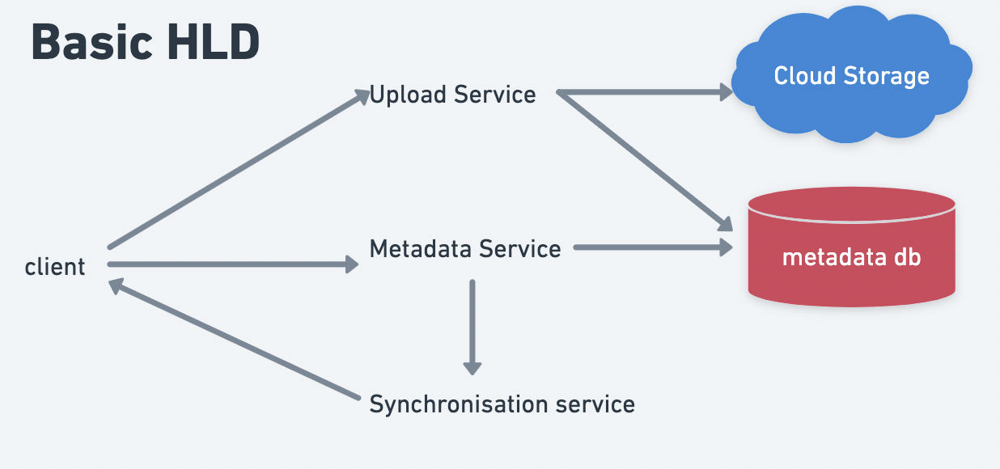


## 9. Google Docs 🐽

* Video: [here](https://www.youtube.com/watch?v=2auwirNBvGg\&ab\_channel=TechDummiesNarendraL)
* Part 2: [here](https://www.youtube.com/watch?v=U2lVmSlDJhg\&ab\_channel=TechDummiesNarendraL)
  * this video's text in [this article](https://www.linkedin.com/pulse/system-design-google-docs-rahul-arram/)

#### #6. Detailed HLD ================================================

* **Will Locking work?**
  * \*\*=> NO, \*\*as 100s of people use the doc at the same time
  * \=> We've to use a **lock-free design**
* **Optimistic Concurrency Control:**
  * using
    1. Versioning
    2. Conflict Resolution
* **Sync Strategies**
  1. **Event Passing**
     * character-by-character sync
     * keep track of full file for each user & sync it
     * every change made by user: (CRUD, font change etc) has to be sent as \*\*an event \*\*to all the other people who are editing the doc
     * **==> Google doc uses this✅**
  2. **Differential Sync**
     * similar to `git diff`
     * Just keep the diff's of users & keep sending it to all of them to maintain the sync
     * might be tedious if many people update the same file section
* **Operational Transformation**

## 10. Pastebin/gist

* Code/file snipped sharing service
* whimsical [link](https://whimsical.com/pastebin-4xky1h5bhCG2S9YL7VEB7k)

#### #1. Requirement Gathering ======================================

#### 1.1 Functional Requirements

* paste (max file size allowed = 10MB)
* generate custom URL path for sharing
* snippets expiry (after 6 months/ customisable?)
* user login / Anonymous ; to see all his previous snippets

#### 1.2 NonFunctional Requirements - Usage Patterns(read heavy/CAP tradeoffs)

* Durability
  * Once you write data; it will always be there
  * irrespective of:
    * High load
    * server crashes
    * DB full
    * DB down
* High availability
* Low latency
  * user should be able to access the gist from url, as fast as possible

#### 1.3 Out of Scope

* Analytics
* API Support

#### #2. Back-of-the-envelope estimation ============================

#### 2.1 Scale of System

* **100K** users **create** new snippets daily
  * \=> 100K/(24\*3600) = **150 writes/sec**
  * **=> 30% buffer ===> 200 reads/sec**
* read:write = 10:1 => **100K reads**
  * \*\*=> **reads =** 1500 reads/sec \*\*
  * **=> 30%Buffer ===> 2K reads/sec**

#### 2.2 Storage size estimation

* \*\*worst\_case: \*\*max size of a snippet = 10MB
  * \=> 10MB\*100K = **1000GB/day (worst\_case)**
  * \*\*=> \*\*1000GB\*365 = **365 TB/year**
* **avg\_case:** avg. size of snippet = 100KB
  * \=> 100KB\*100K = **10 GB/day (avg\_case)**

#### #3. APIs =======================================================

* `addPaste(api_dev_key, paste_data, custom_url=None user_name=None, paste_name=None, expire_date=None)`
  * **Returns:** (string)
* `getPaste(api_dev_key, api_paste_key)`
  * Returns JSON blob
* `deletePaste(api_dev_key, api_paste_key)`

#### #4. Models:Classes, DB Schema & ER diagrams=====================

#### 4.1 Tables Schemas

* **User**
  * id
  * name
  * createdAt
  * metaData
* **Snippet**
  * id
  * content(10KB)
  * s3\_link
  * createdAt
  * expiresAt
  * userID

#### 4.2 DBs choices(NoSQL/SQL)

* **Metadata DB**: SQL or NoSQL ( both are fine)
  * this has just the reference of snippet
* \*\*Blob/Object DB \*\*: For storing the actual snippets
  * **S3**
* **\[Hybrid Approach]For better UX:**
  * store small chunk (10KB) of snippet in \*\*Metadata DB \*\*as well;
  * so that user doesnt have to wait for async req of Blob pull

#### #5. Draw 'Basic HLD'=============================================

#### #6. Detailed HLD ================================================

* Go **severless/lamda** for APIs!!!
* **Url creator :: Distributed Key Generation Service (DKGS)**
  * have a separate Service for this
  * This service has precomputed keys(stored in **redis)**; which we can fetch to generate unique url with **minimum SLA**
    * Another approach was; to get row\_id from metadataDB itself & use it in url=> but this will increase SLA
  * Similar technique(\*\*DKGS) \*\*is used by **twitter as well!!**
  * \*\*ADDED\_BONUS: sprinkle \*\*some \*\*salt \*\*of userID/fileName etc to make it uniquely hashed

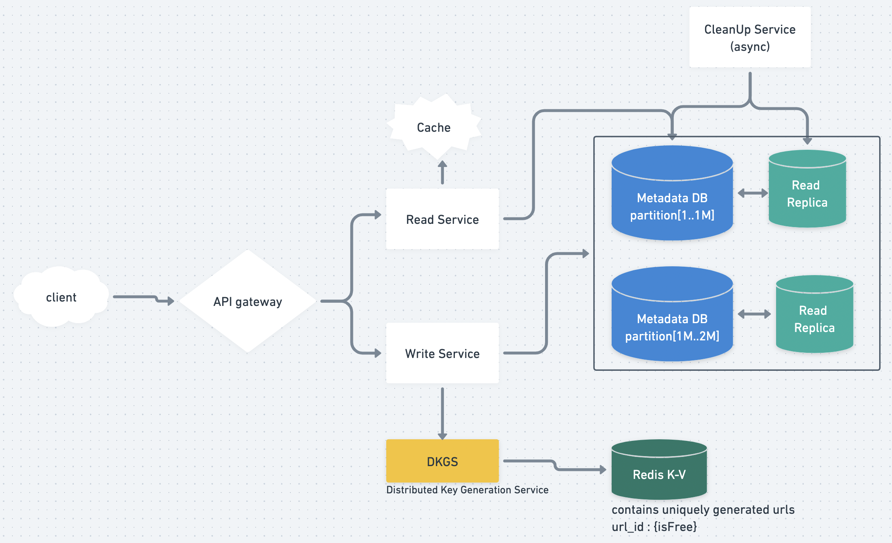

## 11. Typeahead Suggestion

\>>> Use **Trie**

* Whimsical [link](https://whimsical.com/typeahead-Rf18XgXGQ5bFU7wEgEGJds)
* Video [link](https://www.youtube.com/watch?v=xrYTjaK5QVM\&t=1s\&ab\_channel=TechDummiesNarendraL)

#### #1. Requirement Gathering ======================================

#### 1.1 Functional Requirements

* Response Time (<100ms) => looks like real-time
* Relevance & context of predictions
* Sorted results
* Top **K** results

#### #2. Back-of-the-envelope estimation ============================

#### 2.1 Scale of System

* Google gets **5B searches** every day:
* \*\*20% \*\*of these searches are **unique**(yes, there are lots of duplications)
* we want to index only \*\*top 50% words \*\*(we can get rid of a lot of less frequently searched queries)
  * \=> will have **100 million unique terms** for which we want to build an **index**

#### 2.2 Storage size estimation

* query consists of\*\* 3 words\*\*
* average length of a word is **5 characters**
  * \=> this will give us
* we need 2 bytes to store a character
* total storage we will need = 100M \*(15\*2byte) => **3GB**

#### 2.3 Bandwidth estimation(read+write)

*

#### #3. APIs =======================================================

*

#### #4. Models:Classes, DB Schema & ER diagrams=====================

#### 4.1 Tables Schemas

* User
* Trending Keywords
* Prefix hash table:
  * prefix
  * `top_k_suggestions`

#### 4.2 DBs choices(NoSQL/SQL)

*

#### #5. Draw 'Basic HLD'=============================================

#### #6. Detailed HLD ================================================

* **Relevance/Context:**
  * give rank to each word; based on
    * how many times user has searched
    * trending keywords
    * NLP based
  * \*\*Precompute \*\*this rank to all the words
* **Search Algo:**
  * Normal Trie implementation:
    * **Complexity: `O(L) + O(N) + O(klogk)`**
      * L : length of the prefix typed
      * N: total number of childnodes under prefix node
      * k: number of\*\* sorted predictions\*\* required by the system
  * **How to make the algo Faster?**
    * \*\*=> Precompute \*\*top K words for each node😎
      * \===> no traversal required
    * **Complexity Now**: **`O(L)`**

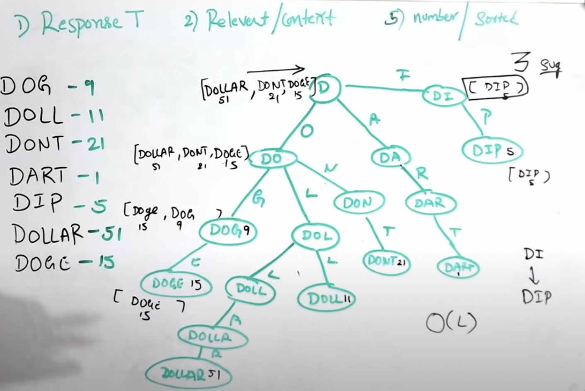

* **How to store Trie in DB?**
  * **=> use prefix hash table**
* **How to update the Trie?**
  * Updating trie is extremely **resource intensive**
  * Do it **offline**, after certain interval, periodically
  * Employ **Map/Reduce** here


## 12. API Rate Limiter

* \*\*Video: \*\*[link](https://www.youtube.com/watch?v=mhUQe4BKZXs\&ab\_channel=TechDummiesNarendraL)
* **Use Cases:**
  * Security: prevent DDoS attacks
  * Freemium model(e.g. ML APIs)
* **Type of Rate limiting:**
  * number of request allowed per user per hour/day
  * Concurrent(system wide): prevent DDoS attacks
  * location/IP based
* **Algorithms available to do Rate Limiting:**
  1. **Token Bucket**
     * For every user; store his last API hit time & number of tokens left
     * **e.g: ProductHunt API**
     * `user_id -> {last_hit_time, tokens_left}`
     * store this in **key-val DB (Redis)**
     * for each new request; update the values in DB
     * Deny request when tokens\_left = 0
  2. **Leaky Bucket**
     * maintain a **fixed-size-queue**
     * All the incoming req(from all users) are processed via this queue(in \*\*FIFO \*\*order)
     * when the queue size is full; deny the incoming requests
  3. **Fixed Window Counter**
     * only **N** requests can be processed in a time \*\*T \*\*
     * so for every window of **`|t .... t+T| `**; count the incoming reqs;
       * when the **counter reached N**; deny the further reqs in this **time duration**
* **Issues in Distributed API Rate limiter**
  1. **Global Inconsistency : Race condition**
     * if every node of the distributed system has its own LB & count-keeper DB;
     * \=> user can hit multiple LBs(situated in diff regions) & bypass the **global-counter check**
     * **How to solve it?**
     * **#1.**=> use **Sticky sessions**
       * i.e. always redirect User1 to Node1
       * **Still issues:**
         * this approach can increase load on certain LBs(while other LBs are free)
     * \*\*#2: \*\*=> use **Locking**
       * \=> Put a lock on user1 key in central DB, each time its updated
       * So that no 2 simultaneous requests can update the **req\_count for the same user**
       * **Its better than Sticky sessions:**
         * as now we can hit all LBs equally
       * **The Bad:**
         * it increases overall response time of the API
     * **Other solutions:**
       * add some buffer to \*\*rate limit \*\*(allow +5%)
         * **The Bad:** defeats the purpose of keeping rate limit
       * keep syncing data b/w nodes
         * \*\*The BAD: \*\*increases latency


## 13. Search Engine | Indexing | Elastic Search

* 3 Steps of A Search Engine:


**1. Crawling:**

* Google servers keep crawling chunks of internet
* while crawing, it keeps \*\*rank \*\*of each page(using **page\_rank**)
  * if more & reputed sites are directing to a site, it has high rank
  * **Damping factor**(e.g. dp = 0.85) for **random access**
    * i.e. 85% of the time crawler will get move to the directed site
    * 15% of the time crawler will jump to **any random page on** **whole internet**

**2. Inverted Indexing**

* Working(below pic)
* puts all this \*\*metadata \*\*in **metadata\_db**
* **Implemented using B-Trees - `O(logN)`**


**3. Querying/Searching**

* Sanitize, filter, stemm, lemmatize the search query to get **query\_keywords**
* **e.g.: Keyword targeting @flipkart 😎**
* **Approaches:**
  1. **Conjunctive Querying -> AND**
     * Performs\*\* AND operation\*\* on all the\*\* `words in query_keywords` \*\*
     * returns only those docs which have all the keywords present in them
  2. \*\*Disjunctive Querying -> UNION \*\*
     * Takes all the document which have **ANY of the keyword present**
     * then performs **UNION** on these docs
     * Then removes **duplicates** from the result
  3. **Conjunctive with Positioning**
     * The order of words in query is also imp!!!
       * E.g: if query is `men in black`
       * And if you dont consider the order of words; you'll also return results for `black in men`😂
     * HOW does it work?
       1. get results of normal **Conjunctive Querying**
       2. filter only those results which have **relative ordering** in place
          * E.g.
            * QUERY: men-0, in-1, black-2
            * Valid results: men-12, in-100, black-150✅
            * Invalid results: men-100, in-20, black-5❌

## 14. Uber

*   **Location DBs**

    * \*\*\*\*[GauravSen](https://www.youtube.com/watch?v=OcUKFIjhKu0\&ab\_channel=GauravSen)
    * zip codes aren't practical
    * \*\*Fractals: \*\*divide the space into smaller spaces:
      * Store as **B-Tree**

    ***

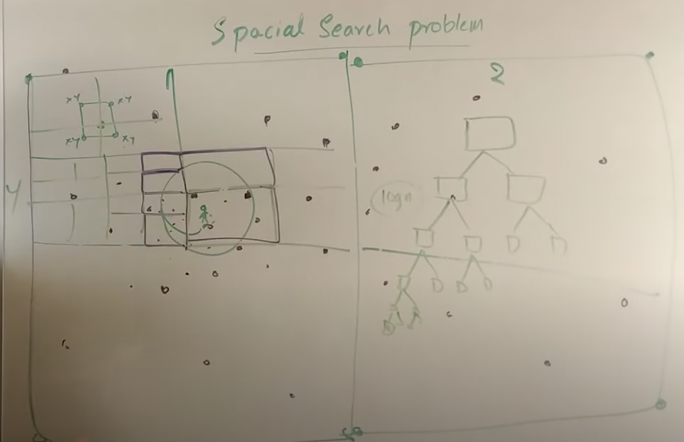


## 15. OTP Generation

* See\*\* #TinyUrl\*\*

## 16. Distributed Locks

* [Video](https://www.youtube.com/watch?v=v7x75aN9liM\&ab\_channel=TechDummiesNarendraL)
* See \*\*#GoogleDoc \*\*& **#APIRateLimiter**
* Use\*\* LockManager\*\*

## 17. Yelp | TripAdvisor | find Nearest Friend

* **Location DBs**
  * See #**Uber**

## 18. Distributed Logger

#### System Requirements

* High availability
* High consistency: no conflict
* Minimum data loss
* Low latency
* Minimum operation overhead

#### 1.Approach#1 : Log Consolidation

* \*\*How does it work? \*\*
  * In each of the distributed server we, install an agent which will monitor any logs that are written on this server
  * The App writes logs to the defined destination(e.g. logs to console)
  * Then the agent in background picks it and sends it to **centralize server(eg. `splunk`, `logstash`)**


#### 2.Approach#2: Log Streaming

* **How does it work?**
  * All the servers push their logs in Kafka queue
  * Kafka sends these logs to multiple subscribers
  * These subscribers process these logs & write them on a centrailzed place/run analytics
  * \*\*used@Pinterest \*\*(below pic from **Pinterest's** conference)


* **Issues with This Approach (**#2: Log Streaming\*\*)\*\*
  * \*\*DATA LOSS: \*\*when an **Kafka broker fails**; it result in **Data Loss**.
    * \*\*FIX: \*\*
      * pick a kafka leader;
      * this leader keeps track of health of its children brokers
      * leader decides which kafka broker have to choose/remove/rep
  * \*\*OPERATION OVERHEAD: \*\*Have to **reconfigure all the dependent services; when we add/replace a new kafka broker**
    * **FIX**:
      * leader decides which kafka broker have to choose/remove/replace
  * \*\*DaTA DUPLICATION: \*\*multiple copies of message among brokers
    * \*\*FIX: \*\*
      * Use a sanitisation service before writing logs to S3/HDFS

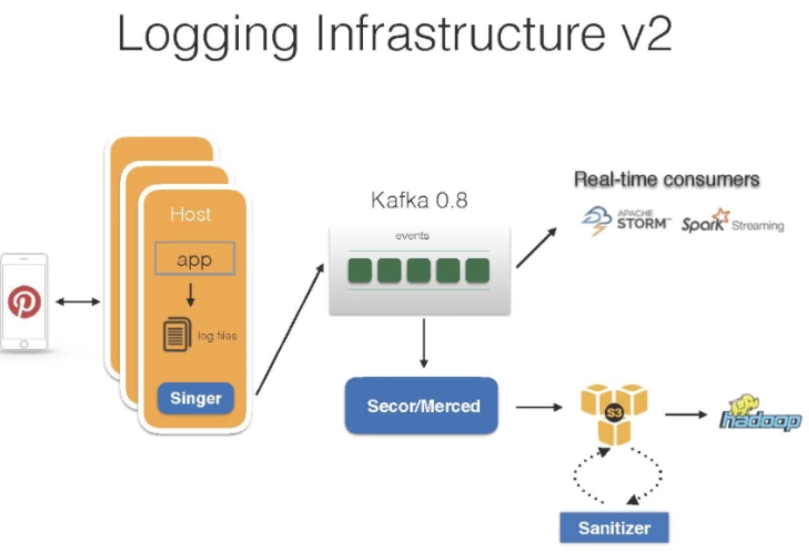

#### #ISSUE with these approaches: `Correlation ID`

* service A runs in server1, it calls service B that runs in server 2 and then another service C that runs in server 3. **How to correlate all the 3 logs for 1 single workflow?**
* **How to fix this?**
  * \=> attach a unique ID(`request_id`or `context_id` ) at **API gateway level** with this request
  * Now this ID will remain same for this log across microservices. Bazinga!

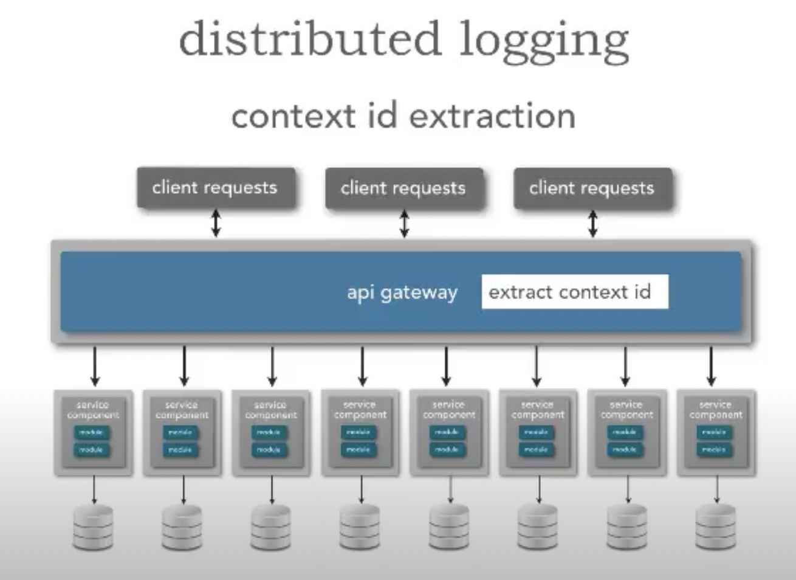

## 19. Slack @coinbase

* [Whimsical](https://whimsical.com/slack-NTe7cDhHvX3AWfF7k9quyw)

#### #1. Requirement Gathering ======================================

#### 1.1 Functional Requirements

* Use should be able to send & receive chat messages from his/her contacts who are also on slack
* Group chat (upto 250 members) ??
* Track messages status: sent/delivered/read ??
  * \=> Slack shows notification if msg was unable to send
* Account registration using mail/phone
* Push Notifications: when the user is offline- send notifications for new msgs
* When the use comes online; he should be able to see all new msgs
* Adding support for media files(img.video.audio)
* E2E encryption

#### 1.2 NonFunctional Requirements - Usage Patterns(read heavy/CAP tradeoffs)

* High availability
* Fault Tolerant
* Consistency
* Scalable
* Minimum latency (real-time chat experience)
* Durability(keep chat history)

#### 1.3 Out of Scope

* Suppor for Slack-web ?
* Analytics/Monitoring

#### #2. Back-of-the-envelope estimation ============================

#### 2.1 Scale of System

* DAU = 500M
* 1 user sends 100 msgs daily
* \==> 50B msgs per day

#### 2.2 Storage size estimation

* size of 1 msg = 100bytes
  * \=> total size = 20B\*100 byte = 2TB/day
    * \=> 5PB for 5 years

#### 2.3 Bandwidth estimation(read+write)

* incoming & outgoing data = 2TB/(24\*3600) = 25MB/s

#### #3. APIs =======================================================

* **1-to-1 Chat**
  * `createAccount(API_key, use_id, name, email...)`
  * `validateAccount(API_key, user_id, validation_code)`
  * `initiateDirectChatSession(API_key, sender_id, receiver_id, handshake_info)`
    * \=> for initial handshake
  * `sendMessage(API_key, session_id, msg_type, msg)`
    * `Returns msg_id`
  * `getMessageStatus(API_key, message_id)`
  * `readNewMessage(API_key,session_id, last_msg_id)`
    * `last_msg_id`to be used as **pointer** to separate b/w read & not-read msgs
* **Group chats**
*
  * `createGrop(API_key, group_id, group_name, `**`admin, [members]`**`)`
  * `addUserToGroup(API_Key, group_id, user_id,admin_id)`
  * `removeUserFromGroup(API_Key, group_id, user_id,admin_id)`
  * `promoteMemberToGroup(API_key,group_id,user_id)`

#### #4. Models:Classes, DB Schema & ER diagrams=====================

#### 4.1 Tables Schemas

* **User**
  * user\_id: PK
  * name
  * email
  * ...
* **Group**
  * groupID: PK
  * name
  * created\_time
  * member\_count
* **GroupMembership**
  * groupID: **PK**
  * userID: **SK(Secondary Key)**
  * creation\_time : datetime
  * user\_type: ADMIN,MEMBER
* **Sessions**
  * session\_id : PK
  * user\_id
  * appserver\_id
  * last\_activity
  * timestamp

#### 4.2 DBs choices(NoSQL/SQL)

* **How to shard GroupMembership table**
  * \*\*Option#1: \*\*Shard by groupID => Called **Local Index**
    * \=> then membership info will be spread across all the shards to which user belongs
  * \*\*Option#2: \*\*Shard by userID(**SK**)=> Called **Global Index**
    * \=> group info will be spread
  * **WHich one to choose:**
    * it seems to me that **creating groups and updating their membership is potentially less frequent** than the ongoing msgs posted into the group chats by users.
    * So the Session and Fanout service benefits **more from a global index on userID**.
    * Users who create/update a group will necessarily have to wait for scatter/gather across partitions but this is less frequent than the msg posts occurring within the group chats.

#### #5. Draw 'Basic HLD'=============================================

### #WebSockets

* **USE CASE: chatting @whatsapp**
* In the beginning; a **Handshake** connection(usually **HTTP**) is established b/w client & server
* After this; the client & server communicate through a **bi-directional long-lived TCP connection**
* **PROS:**
  * bidirecional low latency communication
  * Reduced overhead of HTTP requests
* **CONS:**
  * Clients are responsible for connections
  * Scalability challanges

**Hystrix:**

* \=> Hystrix is a\*\* latency and fault tolerance library\*\* designed to isolate points of access to remote systems, services and 3rd party libraries
* Advantages:
  * Stop cascading failures i.e. reject the request if it cant be handled
  * Realtime **monitoring** of configurations changes
  * Concurrency aware request caching
  * Automated batching through request collapsing
* IE. If a micro service is failing then return the default response and wait until it recovers.

#### 1. Gateway Service

* Responsible for creating \*\*websocket connection \*\*b/w app server & user
* Makes all the API calls to other services as per the user's request

#### 2. Sessions Service

* stores info: which client is connected to which server
* When clientA sends a msg to clientB:
  * clientA sends msg to geteway\_service
  * gateway\_service is pretty dumb(doesnt have inofo on usr's session)
  * gateway\_service passes this req to sessionService
  * session services returns with the details of clientB
  * then gateway service sends that msg to client B
* **+--> Enters WebSockets**

#### 3. UserActivity Service

* takes care of last seen/typing....
* polling/webSockets

#### 4. Group Service

* How does group msging work?
* Fanout sevies asks group srervice for all group data
* then it fans out msgs to all the members
* **DO: batch\_processing /limit the number of users**

#### **5. Someone's typing...**

* typing indicator was triggered on the first keystroke and repeated as more keystrokes occurred.
* If no keystrokes were registered after 10 seconds, the indicator would no longer be displayed. Either you were typing, or you weren’t.
* **If a user stops typing for five seconds, Slack removes the “person is typing” indicator.**
* So when user starts typing update your database and set isTyping true.
* Dont forget to check if isTyping set to true so it will not update every time user presses the key
*   \*\*EVENT is \*\*Implement using a \*\*pub/sub \*\*trigger

    ```
    {
      "isTyping":true,
      "fromDeviceToken": "xxxx",
      "timestamp": 12345
    }
    ```
* \*\*ISSUE: \*\*If user A **connection is lost during typin**g then the status will be always remain true until he resumes the connection. To solve this problem you can have one DateTime field in your firebase object

#### #6. Detailed HLD ================================================

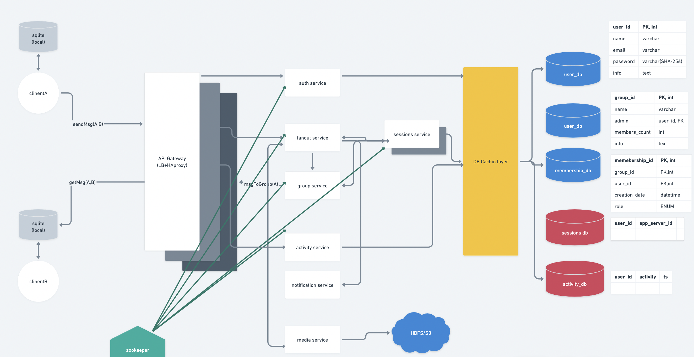


## 20. Stocks Exchange


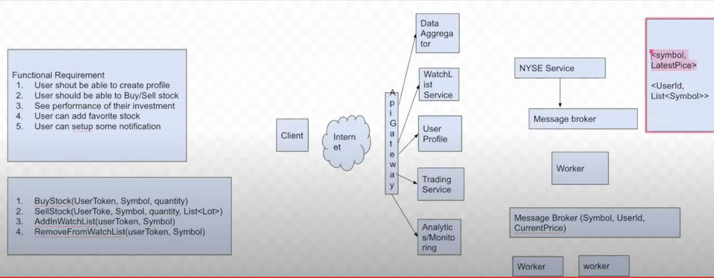


## 21. Flash Sale/Vaccination Drive/Cowin

#### Src: [amazing Shopify Video](https://www.youtube.com/watch?v=-I4tIudkArY\&ab\_channel=ShopifyEngineering)

#### 1.1 What is the system?

* **Limited availability system:** both in terms of
  1. **quantity**: Number of ordering request is much larger than inventory size. (1 million users competing for 10,000 items/slots)
  2. \*\*time: \*\*Large number of users come to the system at the same time, causing a spike in traffic. (sales starts at 6am and finishs at 6:30am)
* System is checkout-driven; ==> so its \*\*write-heavy \*\*
  * so we **cant** simply just push a **Cache** in front of everything & call it a day
* social-media bashing when/if you fail => **Reputation**

#### 1.2 What are the challenges we're dealing with?

1. **Handle load on read**. Users will constantly **refresh** the page\*\* to check available inventory\*\*. It’s also likely that all users will **request for other similar resource at the same time**, such as account, item description, etc.
2. **Provide high throughput**. There will be many **concurrent read and write** to the limited inventory records, so the **database lock** may result in timeout for some of the requests.
3. **Avoid** inventory from being **oversold or undersold.** how to handle the available inventory number?
   * An item may be oversold if multiple requests reserved the same inventory. A
   * n item may be undersold if the inventory is hold but the process failed and inventory is not released.
   * This happened to some e-commerce website, and usually they will call the customers to **refund**.
4. **Prevent cheating with script**. user could write a script to fire request in a **loop**. so this user may generate many repeated requests

#### #2. Back-of-the-envelope estimation ============================

#### 2.1 Scale of System

*

#### #3. APIs =======================================================

* /catalogue/:item\_id
* /checkout

#### #5. Draw 'Basic HLD'=============================================


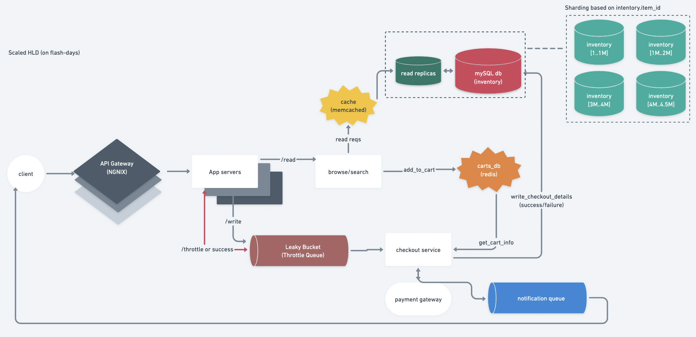

### How to scale-up for FlashSales

* \*\*@client side: \*\*
  * **@UI:** Disable submit button once clicked
  * **@server side**: dont allow mulitple reqs with same `item_id `& `user_id`
* \*\*@DB(sql): \*\*
  * have a `serialisable` \*\*isolation level \*\*for the transaction which affects performance.
    * If we do not apply this isolation level, we may end up with phantom read and thought that we still have enough inventory this request, and then we sell more than what we have.
    * To handle this, we can use a **counter with atomicity**. **Redis** will be a good choice for atomic decrement when a request need to be processed.
  * read replicas
  * sharding
* Use Application LB (such as **NGNIX)**, it can be used for:
  * Reverse Proxy
  * Edge LB
  * Request throttling
  * SSL
* **Back Pressure/ Leaky Bucket: ---> to improve UX**
  * Even if you've optimized every query; you cant server all the requests
  * Make the platform handle back-pressure: "Hey wait, I'm at full capacity. Come back later"
  * This\*\* Back Pressure\*\* can be implemented using **Leaky Bucket**.
  * **LOGIC:================================**
    * \*\*Algorithms to Rate Limit the reqs (\*\*taken from #12. API **)**
    *   **Token Bucket❌**

        * For every user; store his last API hit time & number of tokens left
        * **e.g: ProductHunt API**
        * `user_id -> {last_hit_time, tokens_left}`
        * store this in **key-val DB (Redis)**
        * for each new request; update the values in DB
        * Deny request when tokens\_left = 0
        * \*\*Con: \*\*not useful here, as every req is from a new user

        **2. Leaky Bucket ✅**

        * maintain a **fixed-size-queue**
        * All the incoming req(from all users) are processed via this queue(in \*\*FIFO \*\*order)
        * when the queue size is full; deny the incoming requests

        **3. Fixed Window Counter❌**
    * only **N** requests can be processed in a time \*\*T \*\*
    * so for every window of **`|t .... t+T| `**; count the incoming reqs;
      * when the **counter reached N**; deny the further reqs in this **time duration**
      * **Con:** bad UX & data loss
  * **HOW TO IMPLEMENT =============================================**
    * when you cant handle new checkout requests, serve a **Throttle page**, saying-"Hey, we got your checkout; we'll process it soon.Pleas be patient"
    * **STEPS**:
    * user sends a` /checkout` req to LB
    * LB is out of capacity; so it asks for a **throttle page** from server
    * LB caches this throttle page for future requests & serve it to the user
    * this Throttle page has **Javascript** & some sort of **refresh tags**; that constantly **polls the LB in background**-"hey, do you have capacity now?"
    * when the LB has capacity; it would pass the req to App server
    * And the LB places a **cookie** on **user session**, that "hey, dont throttle this req anymore"
    * So to user; it looks like there wasn't any throttle at all.
  * **CON:**
    * if a user comes at min=0; he has to wait for 30 mins
    * if a user comes at min=29; he might get lucky & have to wait just 1 min
    * So overall; it wouldn't improve the user-chaos
    * **How to solve:**
      * add the timestamp(of when user entered into queue) with the cookie
      * each LB will process these reqs in FIFO
      * but since there are multiple LB's; the system won't be fully stateless; but decent enough

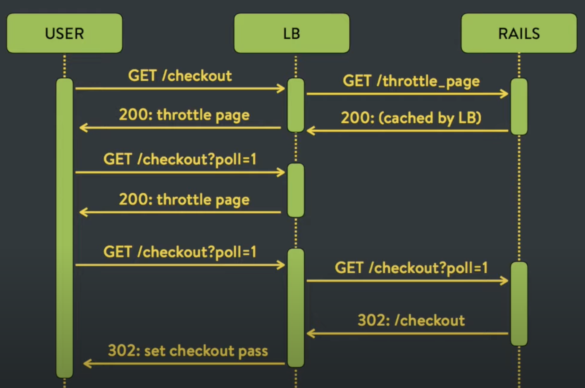

## #More From Leetcode
