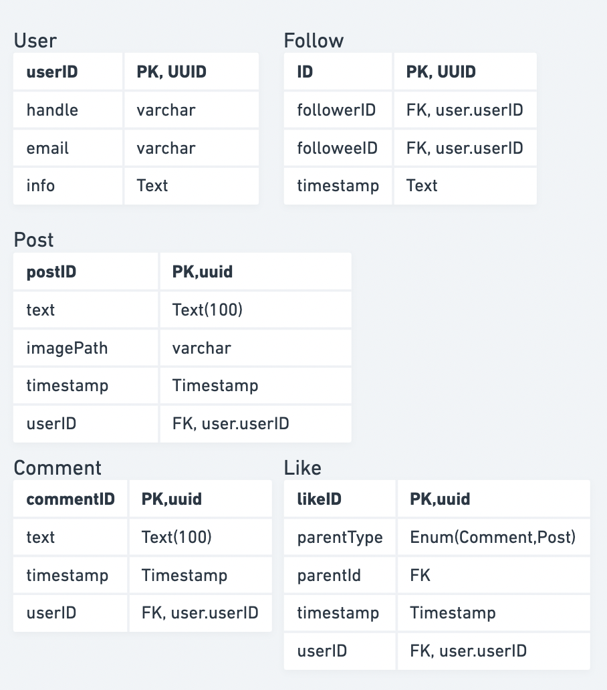

# Instagram

### Concept:

* Media Files
* News Feed Generation ( see Twitter too)

### Resources

* Whimiscal [Board Link](https://whimsical.com/instagram-TofiB1JrEPSiGg9tHkXTgN)

## 1. Requirement Gathering

### 1.1 FRs:

* Users can create account&#x20;
* Users can make posts(photos/text)&#x20;
* Users can follow other users&#x20;
* Users can like+comment on others/self' posts&#x20;
  * \[?] Comment on a comment? => how many recursion levels(1?) \*\[?] like a comment?
* Timeline of all those whom user follow

### 1.2 NFRs

* Service is hightly available&#x20;
  * The acceptable latency of the system is 200ms for News Feed generation.
* &#x20;Consistency can take a hit (in the interest of availability)
  * &#x20;if a user doesn’t see a photo for a while; it should be fine.&#x20;
* &#x20;The system should be highly reliable; any uploaded photo or video should never be lost.
* &#x20;System is read heavy&#x20;
* &#x20;Users can upload as many photos as they want&#x20;
  * \=> Storage management is crucial&#x20;
* Low latency is expected while viewing photos&#x20;
* Data should be 100% reliable. If a user uploads a photo, the system will guarantee that it will never be lost.

### 1.3 Out of Scope:&#x20;

* \[]? Notifications
  * Push notifications => normal user&#x20;
  * Celebrity ===> PULL Notifications
* Adding tags/flairs to photos&#x20;
* searching photos on tags&#x20;
* commenting on photos&#x20;
* tagging users to photos&#x20;
* follow recommendation

## 2. BOTEC

### 2.1 Scale of System&#x20;

\* Total Userbase : 500M \* Daily Active Users: 1M \* 2 new photos per user day => 2M new photos per day

### 2.2 Storage size estimation

* &#x20;size of 1 photo = 5MB&#x20;
  * \=> Space required per day : 2M\*5MB = 10 TB&#x20;
  * \=> Total space required for 10 years = (10 TB )(365)(10) = 36.5 PB \~ 40 PB (accounting decrease in camera price)

## 3. APIs&#x20;

1. POST /user/:id :: {userData}
2. GET /user/:id
3. POST /follow/:followeeID
4. POST /like/:postID
5. POST /comment/:parentID
6. GET /getFeed&#x20;
   1. Feed Generation Service PRECOMPUTES user's feed "hourly" & stores in cache&#x20;
   2. Based On:&#x20;
      1. GET /getUsersFollowedBuy/:userID => set&#x20;
      2. then-> GET /getPostsByUser/:userID => set # N-latest posts by each

## 4. Tables

## 5. DB Discussion: SQL(❌)  vs NoSQL (✅)

### 5.1 DB Discussion

#### 5.1.1 Primary Tables <mark style="color:yellow;">=> NoSQL</mark>

* <mark style="color:orange;">**Benefit of SQL: **</mark>
  * Since we require joins; it'd be straightforward to use SQL ✅
  * But SQL is not good for scaling(as set in NFRs) ❌
* <mark style="color:orange;">**Benefit of NoSQL: **</mark>
  * Our non-functional requirements dictate that the datastore needs to be **highly available, scalable, performant, and durable.**&#x20;
  * <mark style="color:orange;">=></mark> <mark style="color:orange;">**NoSQL**</mark> <mark style="color:orange;">DBs are good at this</mark>

#### 5.1.2 Media Datastore <mark style="color:yellow;">=> Distributed Datastore</mark>

* Use **HDFS/S3 **for storing Media
  * We can store the above schema in a distributed store to enjoy the benefits offered by NoSQL.&#x20;
  * All the metadata related to photos can go to a table where the ‘key’ would be the ‘PhotoID’ and the ‘value’ would be an object containing PhotoLocation, UserLocation, CreationTimestamp, etc.

#### 5.1.3 Relationship Datastore <mark style="color:yellow;">=> WideColumn</mark>

* We need to store relationships between users and photos, to know who owns which photo. We also need to store the list of people a user follows. For both of these tables, we can use a wide-column datastore like [Cassandra](https://en.wikipedia.org/wiki/Apache\_Cassandra). For the ‘UserPhoto’ table, the ‘key’ would be ‘UserID’ and the ‘value’ would be the list of ‘PhotoIDs’ the user owns, stored in different columns. We will have a similar scheme for the ‘UserFollow’ table.
* Cassandra or key-value stores in general, always maintain a certain number of replicas to offer reliability. Also, in such data stores, deletes don’t get applied instantly, data is retained for certain days (to support undeleting) before getting removed from the system permanently.
* we need to have an index on (PhotoID, CreationDate) since we need to fetch recent photos first.

### 5.2 Caching Discussion

#### <mark style="color:yellow;">-> Discuss Global Cache ✅ vs. Local Cache ❌</mark> 

## 7. HLD

