# HLD : Theory

## 🟡**>>> Summary : {1,2,3}**


## 1. **Scalability Trade-offs**

* There’s no free lunch i.e. everything is a trade-off:
  1. Performance vs scalability
  2. Latency vs Throughput
  3. Availability vs Consistency

### 1.1 **Performance vs scalability :Tradeoff**

* How do I know if I have a **performance** problem?
  * If your system is slow for a single user
* How do I know if I have a **scalability** problem?
  * If your system is fast for a single user but slow under heavy load

### 1.2 Latency vs Throughput :Tradeoff

* **Latency** is the time to perform some action or to produce some result.
* **Throughput** : how many such actions can you perform in 1 unit of time
  * i.e how many people can you serve **simultaneously**
  * **NOTE**: `throughput != 1/latency`
* Generally, you should aim for \*\*maximal throughput \*\*with **acceptable latency**.

### 1.3 Availability vs Consistency : Tradeoff

* Brewer’s **CAP theorem**: For a system, At a given point in time you can only pick 2 out of these 3:
  * **Consistency** - Every read receives the most recent write or an error
  * **Availability** - Every request receives a response, without guarantee that it contains the most recent version of the information
  * **Partition Tolerance** - The system continues to operate despite arbitrary partitioning due to network failures
* In a **centralized system (**<mark style="color:yellow;">**RDBMS**</mark>** etc.)** we **don’t have** network partitions, e.g. **P in CAP**:
  * So you get both:
    * Availability
    * Consistency
  * Hence they are <mark style="color:yellow;">**ACID**</mark>**:**
    * Atomic
    * Consistent
    * Isolated
    * Durable
* In a distributed system we \*\*(will) have \*\*network partitions, e.g. **P in CAP**
  * So you get to only pick one:
    * Availability
    * Consistency
* **CAP in practice:**
  * Networks aren't reliable, so you'll **need to support partition tolerance(P)**. You'll need to make a software tradeoff between consistency and availability.
  * So, there are only two types of systems:
    * 1\. **CP**
      * Waiting for a response from the partitioned node might result in a timeout error.
      * **CP** is a good choice **if your business needs require atomic reads and writes**.
    * 2\. **AP**
      * Responses return the most readily available version of the data available on any node, **which might not be the latest**.
      * Writes might take some time to propagate when the partition is resolved.
      * **AP** is a good choice if the **business needs allow for** [**eventual consistency**](https://github.com/donnemartin/system-design-primer#eventual-consistency) or when the system needs to **continue working despite external errors.**
* ...there is only one choice to make. In case of a network partition, what do you sacrifice?
  * 1\. C: Consistency
  * 2\. A: Availability
* Hence these systems(**CP & AP**) are <mark style="color:orange;">**BASE**</mark>:
  * **Basically Available**&#x20;
  * **Soft state**&#x20;
  * **Eventual consistency**


***

## **2. Consistency Patterns**

### **2.1 Weak consistency**

* After a write, reads may or may not see it. A best effort approach is taken.
* This approach is seen in systems such as **memcached**.
* Weak consistency works well in real time use cases such as **video calls**, and realtime multiplayer games.

### **2.2 Eventual consistency**

* After a write, reads will eventually see it (typically within milliseconds).
* Data is **replicated asynchronously**.
* This approach is seen in systems such as **DNS** and **email**.
* **Eventual consistency works well in highly available systems**.

### **2.3 Strong consistency**

* After a write, reads will see it. Data is **replicated synchronously.**
* This approach is seen in file systems and **RDBMSes**.
* Strong consistency works well in **systems that need transactions**.

## 3. **Availability Patterns**

### 3.1 What | How of Availability

* Availability is often quantified by **uptime** (or downtime) **as a percentage of time the service is available**.
* Availability is generally measured in number of 9s--a service with 99.99% availability is described as having **four 9s.**
*   **99.9% availability - three 9s**

    |                        |                         |
    | ---------------------- | ----------------------- |
    | **Duration**           | **Acceptable downtime** |
    | **Downtime per year**  | **8h 45min 57s**        |
    | **Downtime per month** | **43m 49.7s**           |
    | **Downtime per week**  | **10m 4.8s**            |
    | **Downtime per day**   | **1m 26.4s**            |

    * **99.99% availability - four 9s**

    |                        |                         |
    | ---------------------- | ----------------------- |
    | **Duration**           | **Acceptable downtime** |
    | **Downtime per year**  | **52min 35.7s**         |
    | **Downtime per month** | **4m 23s**              |
    | **Downtime per week**  | **1m 5s**               |
    | **Downtime per day**   | **8.6s**                |

    * **Availability in Sequence: Decreases**
      * `Availability (Total) = Availability (Foo) * Availability (Bar)`
    * **Availability in Parallel: Increases**
      * `Availability (Total) = 1 - (1 - Availability (Foo)) * (1 - Availability (Bar))`

### 3.2 Availability Patterns

* There are two complementary patterns to support high availability:
  1. **fail-over**&#x20;
  2. **replication.**

### **3.2.1. #1.Fail-over (with Fail-back)**

* <mark style="color:orange;">**Fail Over**</mark> => Putting the failed node out of service
* <mark style="color:orange;">**Fail Back**</mark> <mark style="color:orange;"></mark><mark style="color:orange;"></mark> => Restoring the failed node back
* fail-over is not always this simple
* **1. Active-passive Fail-over | OR | **<mark style="color:orange;">**Master-Slave Failover**</mark>
  * With active-passive fail-over, **heartbeats** are sent between the active and the passive server on standby. If the heartbeat is interrupted, the **passive server takes over the active's IP address and resumes** service.
  * The **length of downtime** is determined by whether the **passive server** is already running in <mark style="color:orange;">**'hot' standb**</mark><mark style="color:orange;">y</mark> or whether it needs to start up from <mark style="color:orange;">**'cold' standb**</mark>**y.** Only the active server handles traffic.
  * Active-passive failover can also be referred to as **master-slave** failover.
* **2.Active-active Fail-over | OR | **<mark style="color:orange;">**Master-Master Failover**</mark>
  * In active-active, both servers are managing traffic, **spreading the load** between them.
  * If the servers are **public-facing**, the DNS would need to know about the public IPs of both servers. If the servers are **internal-facing**, application logic would need to know about both servers.
  * Active-active failover can also be referred to as **master-master** failover.
* **Disadvantage(s): failover**
  * Fail-over adds more hardware and additional **complexity**.
  * There is a **potential for loss of data** if the active system fails before any newly written data can be replicated to the passive.

### **3.2.2. #2.Replication**

* Active replication - **Push**
* Passive replication - **Pull**
  * Data not available, read from peer, then store it locally
  * Works well with timeout-based caches
* **Types of Replication architecture:**
  * <mark style="color:orange;">**1.Master-Slave replication**</mark>&#x20;


* <mark style="color:orange;">**2.Master-Master replication**</mark>&#x20;


* <mark style="color:orange;">**3.Tree Replication**</mark>


* <mark style="color:orange;">**4.Buddy replication**</mark>


## **4.DNS**

* Top DNS service providers:
  * **Akamai**
  * **CloudFlare**
  * OpenDNS
  * Oracle
  * **Google Open Domains**
  * Microsoft Azure
* Some DNS services can route traffic through various methods:
  * [**Weighted round robin**](https://www.g33kinfo.com/info/round-robin-vs-weighted-round-robin-lb)
    * Weighted round-robin provides a clean and effective way of focusing on **fairly** distributing the load amongst available resources, **verses** attempting to **equally** distribute the requests.
    * In a weighted round-robin algorithm, each destination (in this case, server) is assigned a value that signifies, relative to the other servers in the pool, how that server performs.
    * This “weight” determines how many more (or fewer) requests are sent that server’s way; compared to the other servers on the pool.
    * Prevent traffic from going to servers under maintenance
    * Balance between varying cluster sizes
    * A/B testing
  * [Latency-based](https://docs.aws.amazon.com/Route53/latest/DeveloperGuide/routing-policy.html#routing-policy-latency)
  * [Geolocation-based](https://docs.aws.amazon.com/Route53/latest/DeveloperGuide/routing-policy.html#routing-policy-geo)
* **Disadvantage(s): DNS**
  * Accessing a DNS server introduces a slight delay, although mitigated by caching described above.
  * DNS server management could be complex and is generally managed by [governments, ISPs, and large companies](http://superuser.com/questions/472695/who-controls-the-dns-servers/472729).
  * DNS services have recently come under [DDoS attack](http://dyn.com/blog/dyn-analysis-summary-of-friday-october-21-attack/), preventing users from accessing websites such as Twitter without knowing Twitter's IP address(es).

## **5.CDN**

* <mark style="color:orange;">=> is a globally distributed network of proxy servers, serving content from locations closer to the user.</mark>&#x20;
* Generally, static files such as <mark style="color:orange;">**HTML/CSS/JS, photos, and videos**</mark> are served from CDN, although some CDNs such as Amazon's CloudFront support dynamic content.
* **The site's DNS resolution will tell clients which server to contact**.
* **Types of CDN:**
  * **Pull CDNs**
    * Pull CDNs grab new content from your server when the first user requests the content. This results in a slower request until the content is cached on the CDN.
    * A [time-to-live (TTL)](https://en.wikipedia.org/wiki/Time\_to\_live) determines how long content is cached. Pull CDNs minimize storage space on the CDN, but can create redundant traffic if files expire and are pulled before they have actually changed.
    * **Sites with heavy traffic work well with pull CDNs**, as traffic is spread out more evenly with only recently-requested content remaining on the CDN.
  * **Push CDNs**
    * Push CDNs receive new content whenever changes occur on your server.
    * You take full responsibility for providing content, uploading directly to the CDN and rewriting URLs to point to the CDN.
    * **Sites with a small amount of traffic or sites with content that isn't often updated work well with push CDNs.**
    * Content is placed on the CDNs once, instead of being re-pulled at regular intervals.
* **Top CDNs:**
  * **CloudFlare**
    * Cloudflare’s CDN has a network capacity\*\* 15 times bigger than the largest DDoS attack ever \*\*recorded and handles modern DDoS to ensure your website stays online.
  * Google Cloud CDN
  * Amazon **CloudFront**
    * Popular with S3 caching
    * Can be used for EC2 Load Balancing
    * Protection against DDoS
    * SSL/TLS encryption of HTTPS

## 6.**Load Balancer**

* Load balancers can be **implemented** with **hardware** (expensive) **or** with software such as **HAProxy**.
* **Advantages of LB:**
  * Preventing requests from going to unhealthy servers
  * Preventing overloading resources
  * Helping to eliminate a single point of failure
  * **SSL termination** - **Decrypt incoming requests** and **encrypt server responses** so backend servers do not have to perform these potentially expensive operations
    * Removes the need to install [X.509 certificates](https://en.wikipedia.org/wiki/X.509) on each server
  * **Session persistence**(**sticky sessions**)- Issue cookies and route a specific client's requests to same instance if the web apps do not keep track of sessions
* Techniques of Failure Protection: it's common to set up multiple load balancers, either in [active-passive](https://github.com/donnemartin/system-design-primer#active-passive) or [active-active](https://github.com/donnemartin/system-design-primer#active-active) mode.
* Amazon's **ELB:**
  * 2 level LB:
    * 1.zone wise(**z1,z2,...**)
    * 2.secondary array of LBs(**LB1,LB2,...**)
  * hence more optimization


### Routing Techniques

* Load balancers can route traffic based on various metrics, including:
  * Random
  * Least busy
  * Sticky session/Cookies
  * Round Robin OR **Weighted Round Robin**
  * **Layer 4 load balancing**
    * Layer 4 load balancers look at info at the [transport layer](https://github.com/donnemartin/system-design-primer#communication) to decide how to distribute requests. Generally, this\*\* involves the source, destination IP addresses, and ports in the header, but not the contents of the packet\*\*.
    * Layer 4 load balancers forward network packets to and from the upstream server, performing [Network Address Translation (NAT)](https://www.nginx.com/resources/glossary/layer-4-load-balancing/).
  * **Layer 7 load balancing( SMARTER 🧠)**
    * Layer 7 load balancers look at the [application layer](https://github.com/donnemartin/system-design-primer#communication) to decide how to distribute requests. This can involve contents of the header, message, and cookies. \*\*Layer 7 load balancers terminate network traffic, reads the message, makes a load-balancing decision, then opens a connection to the selected server. \*\*
    * For example, a layer 7 load balancer can **direct video traffic to servers that host videos** while directing more sensitive\*\* user billing traffic to security-hardened servers\*\*.
  * At the cost of flexibility, **layer 4 load balancing requires less time and computing resources than Layer 7**, although the performance impact can be minimal on modern commodity hardware.

### Horizontal Scaling of LBs

* Scaling horizontally introduces complexity and involves cloning servers
  * **Servers should be stateless**: they should not contain any user-related data like sessions or profile pictures
  * Sessions can be stored in a **centralized data store** such as a [database](https://github.com/donnemartin/system-design-primer#database) (SQL, NoSQL) or a persistent [cache](https://github.com/donnemartin/system-design-primer#cache) (Redis, Memcached)
    * **Redis is better:**
      * its distributed & more persistent
* Downstream servers such as\*\* caches and databases\*\* need to handle more simultaneous connections as upstream servers scale out

### Disadvantage(s): load balancer

* The load balancer can become a **performance bottleneck** if it does not have enough resources or if it is not configured properly.
* Introducing a load balancer to help eliminate a **single point of failure** results in increased **complexity**.
* **On Amazon’s ELB:**
  * Elastic Load Balancing supports the following protocols:
    * HTTP
    * HTTPS (secure HTTP)
    * TCP
    * SSL (secure TCP)

## **7. Proxy | Reverse Proxy**

* **Proxy**: -> Server doesnt know the client
* **FORCED me to buy a new laptop!!!**
* **Proxy Use Cases:**
  * Caching
  * Anonymity
  * Site Blocking
  * Logging
  * Microservices


* **Reversed Proxy:**-> Client doesnt know the final destination
* **Use Cases:**
  * Caching
  * Load Balancing
  * **Ingress**
    * Ingress Rules are a set of rules for processing inbound HTTP traffic
    * An ingress is really just a set of rules to pass to a controller that is listening for them.
    * i.e. based on certain filters; it can guide you to diff routs/services
  * Microservices
  * **Canary Deployment**: New feature testing by any app
* **Benefits of Reversed Proxy**:
  * Increased security - Hide information about backend servers, blacklist IPs, limit number of connections per client
  * Increased scalability and flexibility - Clients only see the reverse proxy's IP, allowing you to scale servers or change their configuration
  * \*\*SSL termination \*\*- Decrypt incoming requests and encrypt server responses so backend servers do not have to perform these potentially expensive operations
    * Removes the need to install [X.509 certificates](https://en.wikipedia.org/wiki/X.509) on each server
  * Compression - Compress server responses
  * **Caching** - Return the response for cached requests
  * **Static content** - Serve static content directly
    * HTML/CSS/JS
    * Photos
    * Videos
    * Etc
* **Disadvantages of Reverse Proxy:**
  * Introducing a reverse proxy results in increased **complexity**.
  * A single reverse proxy is a **single point of failure**, configuring multiple reverse proxies (ie a [failover](https://en.wikipedia.org/wiki/Failover)) further increases complexity.

### **Load balancer vs reverse proxy 🟢🔵🔴**

* <mark style="color:orange;">Load balancer is</mark> <mark style="color:orange;"></mark><mark style="color:orange;">**just an instance of reverse proxy**</mark>
* **Deploying a load balancer is useful when you have multiple servers**. Often, load balancers route traffic to a set of servers serving the same function.
* **Reverse proxies can be useful even with just one application server**, opening up the benefits described in the previous section.
* Solutions such as **NGINX** and **HAProxy** can support both layer 7 reverse proxying and load balancing.

## 7. Cache

### 🟡 >>> 7.0 SUMMARY (7.1, 7.2,7.3, 7.4)&#x20;


### 7.1 Cache Read/Write Policies

* 1 <mark style="color:orange;">**Cache Aside**</mark> (cond: when data in cache is never updated)
* 2 <mark style="color:orange;">**Read Through**</mark> (cond: when data in cache is never updated)
* 3 <mark style="color:orange;">**Write Through**</mark> (cond: data in cache is updated) -> used in <mark style="color:yellow;">**STRONG CONSISTENCY**</mark> systems
  * slower writes
  * strong consistency
* 4 <mark style="color:orange;">**Read Through**</mark> (cond: data in cache is updated) -> used in <mark style="color:yellow;">**WEAK CONSISTENCY**</mark> systems
  * fast writes
  * eventual consistency
  * chances of data loss are there; if cache-> DB write fails
* 5 Read Ahead : difficult to implement(requires heuristics etc)...so lite

.png>)

.png>)


### 7.2 Cache Eviction Policies

* LRU
* LFU
* MFU
* FIFO

### 7.3 Ways to scale up Cache ( i.e. make it Distributed)

* Increase replicas
* <mark style="color:orange;">Shard</mark> ( partition by hash of keys)


### 7.4 Thundering Herd Problem (src: [scaling\_instagram](https://www.youtube.com/watch?v=hnpzNAPiC0E\&ab\_channel=InfoQ))

#### 1. WHAT


* when cache gets invalidated(due to its lifecycle/TTL/etc);
* all the read requests(herds) start trying to access(thundering) the DB for read

#### 2. SOLUTION => Cache Lease on DB


*   **HOW does it work?**

    ⟶ When the first req(d1) access cache & it doesn't find data

    ⟶ cache assigns a LEASE PERIOD & forwards this req to db

    ⟶ Meanwhile if any other req(d2) want to hit DB due to unavailability of data in cache; the cache doesnt allow it. (puts it on <mark style="color:orange;">**wait-or-use-stale**</mark> state)

    ⟶ after d1 is done reading db; the lease is reset & now d2 can hit the DB


## 8.**Scalability Patterns - DB**

Below steps to be taken(as #users increase)

* **Partitioning**
* **HTTP Caching**&#x20;
* **RDBMS Sharding**
  * <mark style="color:yellow;">Scaling</mark> <mark style="color:yellow;"></mark><mark style="color:yellow;">**reads**</mark> <mark style="color:yellow;"></mark><mark style="color:yellow;">to a RDBMS is</mark> <mark style="color:yellow;"></mark><mark style="color:yellow;">**hard**</mark>
  * <mark style="color:yellow;">Scaling</mark> <mark style="color:yellow;"></mark><mark style="color:yellow;">**writes**</mark> <mark style="color:yellow;"></mark><mark style="color:yellow;">to a RDBMS is</mark> <mark style="color:yellow;"></mark><mark style="color:yellow;">**impossible**</mark>
  * <mark style="color:yellow;">How to scale out RDBMS? =></mark> <mark style="color:yellow;"></mark><mark style="color:yellow;">**Sharding**</mark>
    * <mark style="color:orange;">**Partitioning**</mark>&#x20;
    * <mark style="color:orange;">**Replication**</mark>
* **NOSQL**
  * Types
    * Key-Value databases (Voldemort, Dynomite, **Firestore**)
    * Column databases (Cassandra, **HBase, Druid, Clickhouse**)
    * Document databases (**MongoDB**, CouchDB)
    * Graph databases (**Neo4J**, AllegroGraph)
    * Datastructure databases (**Redis**, Hazelcast)
  * NOSQL in the world:
    * Google: Bigtable
    * Amazon: Dynamo
    * Amazon: SimpleDB
    * Yahoo: HBase
    * Facebook: Cassandra
    * LinkedIn: Voldemort
* **Distributed Caching**
* Data Grids

## **8.1 RDBMS**

* **ACID** is a set of properties of relational database [transactions](https://en.wikipedia.org/wiki/Database\_transaction).
  * **Atomicity** - Each transaction is **all or nothing**
  * **Consistency** - Any transaction will bring the database from **one valid state to another**
  * **Isolation** - Executing transactions concurrently has the same results **as if the transactions were executed serially**
  * **Durability** - Once a transaction has been **committed, it will remain so**

#### **Scaling Up a RDBMS**

* Techniques:
  * master-slave replication || master-master replication
  * federation
  * sharding
  * denormalization
  * SQL tuning

#### 1.Master-Master || Master-Slave&#x20;

* already covered up

#### **2.Federation**


* **Federation (or functional partitioning) splits up databases by function.**
* For example, instead of a single, monolithic database, you could have three databases: forums, users, and products, resulting in less read and write traffic to each database and therefore less replication lag
* ​​With no single central master serializing writes you can write in parallel, increasing throughput.
* **Disadvantage(s): federation**
  * Federation is\*\* not effective if your schema requires huge functions or tables\*\*.
  * You'll need to update your application logic to determine which database to read and write.
  * **Joining data** from two databases is more complex with a [server link](http://stackoverflow.com/questions/5145637/querying-data-by-joining-two-tables-in-two-database-on-different-servers).
  * Federation adds **more hardware** and additional **complexity**.

#### **3.Sharding**


* Sharding **distributes data across different databases** such that each database can only manage a **subset of the data.**
* Taking a users database as an example, as the number of users increases, more shards are added to the cluster
* ~~**@fk: partitioned on date ranges**~~
* **Disadvantage(s): sharding**
  * You'll need to update your application logic to work with shards, which could result in complex SQL queries.
  * **Data distribution can become lopsided i**n a shard. For example, a set of power users on a shard could result in increased load to that shard compared to others.
    * Rebalancing adds additional complexity. A sharding function based on [consistent hashing](http://www.paperplanes.de/2011/12/9/the-magic-of-consistent-hashing.html) can reduce the amount of transferred data.
  * **Joining data from multiple shards is more complex.**
  * Sharding adds more hardware and additional complexity.

#### 4. Denormalization:

* Denormalization attempts to **improve read performance at the expense of some write performance**.
* **Redundant copies** of the data are written in multiple tables to avoid expensive joins.
* Some RDBMS such as [PostgreSQL](https://en.wikipedia.org/wiki/PostgreSQL) and Oracle support [materialized views](https://en.wikipedia.org/wiki/Materialized\_view) which handle the work of storing redundant information and keeping redundant copies consistent.
* Once data becomes distributed with techniques such as [federation](https://github.com/donnemartin/system-design-primer#federation) and [sharding](https://github.com/donnemartin/system-design-primer#sharding), managing joins across data centers further increases complexity. Denormalization might circumvent the need for such complex joins.
* **Where to use**: In most systems, **reads can heavily outnumber writes 100:1 or even 1000:1**. A read resulting in a complex database join can be very expensive, spending a significant amount of time on disk operations.
* **Disadvantages:**
  * Data is duplicated.
  * Constraints can help redundant copies of information stay in sync, which increases complexity of the database design.
  * A denormalized database under heavy write load might perform worse than its normalized counterpart.

#### 5. SQL Tuning

* It's important to benchmark and profile to simulate and uncover bottlenecks.
* **Benchmark** - Simulate high-load situations with tools such as [ab](http://httpd.apache.org/docs/2.2/programs/ab.html).
* **Profile** - Enable tools such as the [slow query log](http://dev.mysql.com/doc/refman/5.7/en/slow-query-log.html) to help track performance issues.

## **8.2 NoSQL**

* Data is **denormalized**, and  **joins are generally done in the application code.**
* **Lack true ACID** transactions and have **BASE**:
  * **Basically available** - the system guarantees availability.
  * **Soft state** - the state of the system may change over time, even without input.
  * **Eventual consistency** - the system will become consistent over a period of time, given that the system doesn't receive input during that period.
* **Why Use NoSQ**L:
  * WE ARE STORING MORE DATA NOW THAN WE EVER HAVE BEFORE
  * CONNECTIONS BETWEEN OUR DATA ARE GROWING ALL THE TIME
  * WE DON’T MAKE THINGS KNOWING THE STRUCTURE FROM DAY 1
  * **SERVER ARCHITECTURE IS NOW AT A STAGE WHERE WE CAN TAKE ADVANTAGE OF IT**


* **NoSQL Use Cases:**
  * LARGE DATA VOLUMES:
    * MASSIVELY DISTRIBUTED ARCHITECTURE REQUIRED TO STORE THE DATA GOOGLE, AMAZON, FACEBOOK, 100K SERVERS
  * EXTREME QUERY WORKLOAD:
    * IMPOSSIBLE TO EFFICIENTLY DO JOINS AT THAT SCALE WITH AN RDBMS
  * SCHEMA EVOLUTION:
    * SCHEMA FLEXIBILITY IS NOT TRIVIAL AT A LARGE SCALE BUT IT CAN BE WITH NO SQL
* **NoSQL PROS :**
  * **MASSIVE SCALABILITY**
  * **HIGH AVAILABILITY**&#x20;
  * **LOWER COST**&#x20;
  * SCHEMA FLEXIBILITY SPARCE AND SEMI STRUCTURED DATA
* **NoSQL CONS:**
  * **LIMITED QUERY CAPABILITIES**&#x20;
  * NOT STANDARDISED (PORTABILITY MAY BE AN ISSUE)
  * STILL A DEVELOPING TECHNOLOGY

#### Types of NoSQL

* Determine which type of NoSQL database best fits your use case out of these: \*


#### 1.Key-value store

* **(Abstraction: hash table)**
* generally allows for O(1) reads and writes; hence provide high performance
* **used@systems**: for simple data models or for rapidly-changing data, such as an in-memory cache layer.
* **Used@dbs:**
  * [Redis](http://qnimate.com/overview-of-redis-architecture/)
  * Memcached
  * [DynamoDB](http://www.read.seas.harvard.edu/\~kohler/class/cs239-w08/decandia07dynamo.pdf) supports both key-values and documents
* \*\*For redis: \*\*all the data is stored in **RAM**. this:
  * makes the\*\* access very fast\*\*
  * But,\*\* limits DB capacity \*\*(RAMs are wayyy smaller in size than SSDs)
  * **No support for queries** => limits the data modeling operations
* **Redis is best for**:
  * Cache
  * Pub/sub
  * Leaderboards
* **Redis is used at:**
  * Twitter
  * Github
  * Snapchat

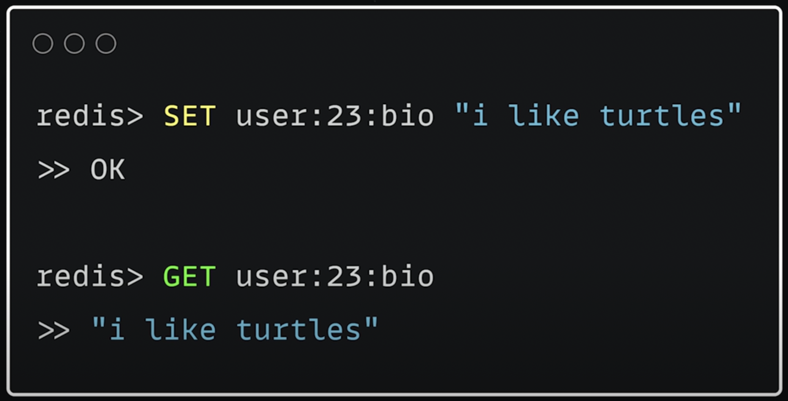

#### 2.Document store

* **(Abstraction: key-value store with documents stored as values)**
* A document store is centered around documents (XML, JSON, binary, etc), where a document stores all information for a given object.
* Document stores provide APIs or a query language to query based on the internal structure of the document itself
* Although documents can be organized or grouped together, documents may have fields that are completely different from each other.
* Some document stores like [MongoDB](https://www.mongodb.com/mongodb-architecture) and [CouchDB](https://blog.couchdb.org/2016/08/01/couchdb-2-0-architecture/) also provide a SQL-like language to perform complex queries.
* **used@systems:** Document stores provide high flexibility and are often used for working with **occasionally changing data**.
* **used@dbs:**
  * **mongoDb**
  * CouchDB
  * DynamoDb
  * **Firestore😎**
* **Tradeoffs**:
  * schema-less ✅
  * relation-ish queires ✅
  * without joins ❌
* **Best for:**
  * very general purpose 💫 i.e. if you're not sure which DB to choose; choose it!
  * most apps
  * IOT
  * gaming

#### 3.Wide column store | Column DBs

* **(Abstraction: nested map ColumnFamily\<RowKey, Columns\<ColKey, Value, Timestamp>>)**
* **Why better that row DBs?**
  * Coulmn DBs are good for \*\*analytics queries: \*\*e.g.how many sales today?
  * Row DBs are good for \*\*transaction queries: \*\*
  * i.e. if DB size increases & you've to do analytics; go column DB
* A column can be grouped in column families (analogous to a SQL table).
* Each value contains a timestamp for versioning and for conflict resolution.
* maintain keys in lexicographic order, allowing efficient retrieval of selective key ranges.
* \*\*QUERYING: \*\*can be done with \*\*CQL(Contextual Query Language) \*\*, which is very similar to \*\*SQL \*\*
  * Schema-less
  * less features than SQL
  * cant do Joins
  * **Got hands on @fk 😎**
* **used@dbs:**
  * Column DBs:
    * **Druid@fk😎**
    * **Clickhouse@fk😎**
  * \*\*Wide Column DBs: \*\*
    * [Cassandra](http://docs.datastax.com/en/cassandra/3.0/cassandra/architecture/archIntro.html) from Facebook
    * \*\*HBase: \*\*open-source \*\*[**HBase**](https://www.edureka.co/blog/hbase-architecture/) \*\*often-used in the **Hadoop ecosystem**
      * Data is stored in \*\*Big table. \*\*
      * Table consist rows and **each rows has arbitrary number of columns**.
      * Every cell value gets assigned by **timestamp** and it plays an important role during operations.
      * **Row keys are lexicographically sorted** and stored in **Bytes** \[].
      * Column name and values are also stored in **Bytes** \[].
      * Columns are **grouped on the basis of properties as a column family**
* \*\*best for: \*\*
  * time-series data
  * historical records => **@netflix**: history of shows people watched
  * high-write, low-read


#### 4.GraphDB (Abstraction: graph)

* **Note**: its **not** related to graphQL at all.**GraphQL is an advancement on REST; not a DB**
* each node is a record and each arc is a **relationship** between two nodes.
* Graph databases are optimized to represent complex relationships with many foreign keys or many-to-many relationships
* used@systems: Graphs databases offer high performance for data models with complex relationships, such as a\*\* social network.\*\*
* **used@dbs:**
  * [**Neo4j**](https://neo4j.com)
  * [FlockDB](https://blog.twitter.com/2010/introducing-flockdb)
* are queried using **Cypher** (a query language).
* Graph DBs are a **greate alternative to SQL dbs**; especially when there are lots of **1-to-many** relations across tables i.e. **lots of joins**.
* **BEST FOR:**
  * graphs
  * knowledge graphs
  * social network
  * fraud detection
  * recommendation engine
* \*\*USED AT: \*\*
  * FB
  * Airbnb -> for its recommendation engine

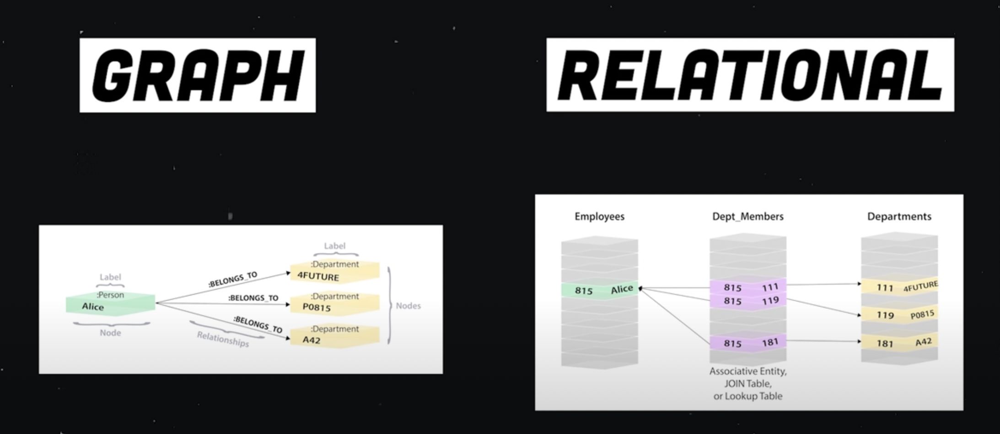

## **9. Consistent Hashing**

* **IDEA:Keys & nodes map to the same space**
* [**link**](https://www.paperplanes.de/2011/12/9/the-magic-of-consistent-hashing.html)


## **10. Message Queues:Asynchronism**

### **10.1 Concept**


* Message queues receive, hold, and deliver messages. If an operation is too slow to perform inline, you can use a message queue with the following workflow:
* An application publishes a job to the queue, then notifies the user of job status
* A **worker** picks up the job from the queue, processes it, then signals the job is complete
* The user is not blocked and the job is processed in the background. During this time, the client might optionally do a small amount of processing to make it seem like the task has completed.
* For example, if posting a tweet, the tweet could be instantly posted to your timeline, but it could take some time before your tweet is actually delivered to all of your followers.
* E.g.s:
  * [Redis](https://redis.io) is useful as a simple message broker but **messages can be lost.**
    * **I've implemented RedisStore for client @Supp 💪**
  * [RabbitMQ](https://www.rabbitmq.com) is popular but requires you to adapt to the 'AMQP' protocol and manage your own nodes.
  * [Amazon SQS](https://aws.amazon.com/sqs/) is hosted but can have high latency and has the possibility of messages being delivered twice.
  * <mark style="color:orange;">**Kafka :**</mark> ensures that data is stored in ** **<mark style="color:orange;">**durable & fault tolerant**</mark>** way.**

### <mark style="color:orange;">**10.2 Kafka**</mark>

* Each topic can have >=1 **partitions**
* **Brokers =>** each server holding >=1 partition is called **Broker.**
* **Record:** each item in a partition is called record
* **Topic:** a group of partition handling the same type of data
* <mark style="color:yellow;">each record in kafka is identified by partition number & offset</mark>
* **Retention Policies (for cleanup):**
  * In kakfa, retention policies are configurable
  * i.e. you can set-up the data cleanup time
    * <mark style="color:orange;">**DISADVANTAGE**</mark>**:** if your application is down for more than retention time; data loss hoga
* Kafka ensures that data is stored in ** **<mark style="color:orange;">**durable & fault tolerant**</mark>** way.**
* **Replication:**
  * kafka replicates each broker; so that if it goes down, the other broker resumes
  * <mark style="color:orange;">`replication_factor: 3`</mark>
    * \=> means 1 leader & 2 replications

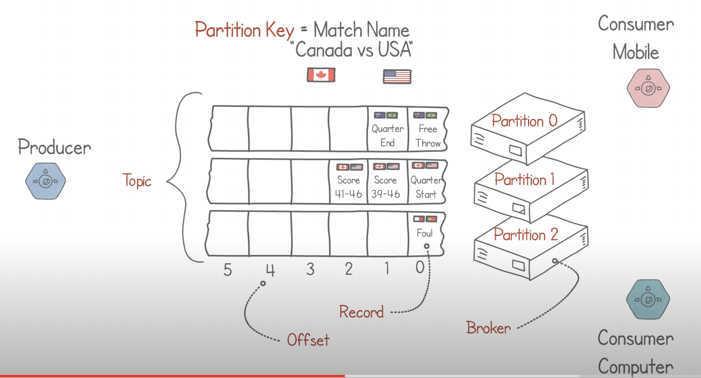

### 10.3 Kafka vs RabbitMQ | [video](https://www.youtube.com/watch?v=GMmRtSFQ5Z0\&ab\_channel=TechPrimers)

* **Diff Summary:**
  * **RabbitMQ**:&#x20;
    * <mark style="color:orange;">push based model</mark>
    * decoupled consumer queues: => every consumer has its own queue
  * **Kafa**:&#x20;
    * <mark style="color:orange;">pull based model</mark>
    * coupled consumer queues => hence needs planning ahead
* **Intro**


* **Architecture Diff**


* **When to Use Which**


## 11. APIs

### 11.1 Request-Response API Paradigms

* REST
* RPC
* GraphQL

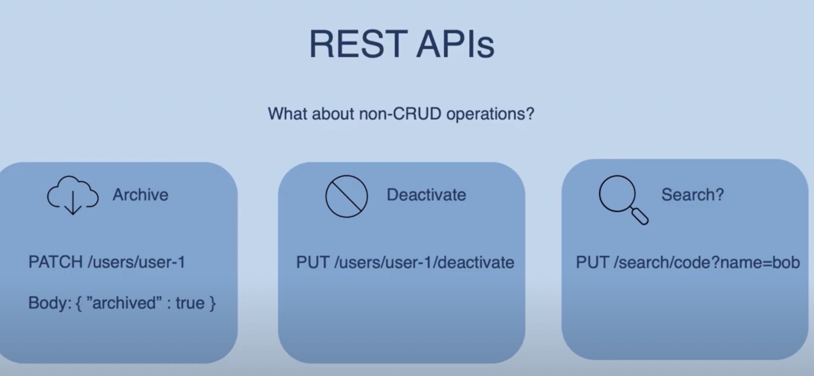


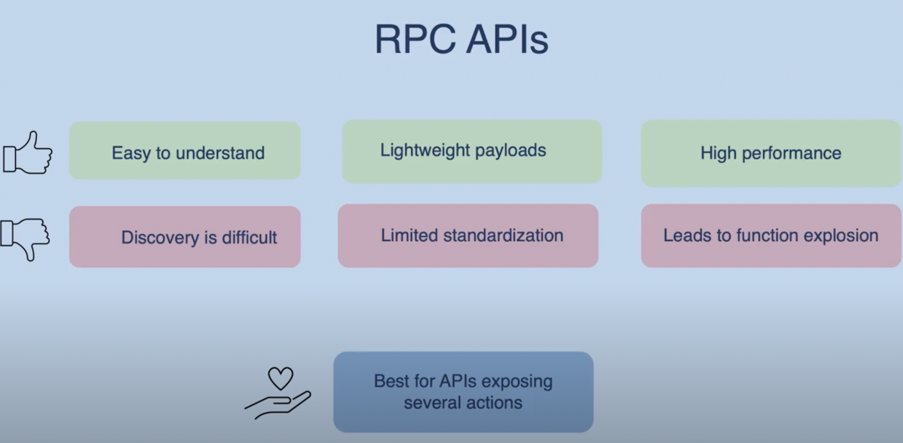

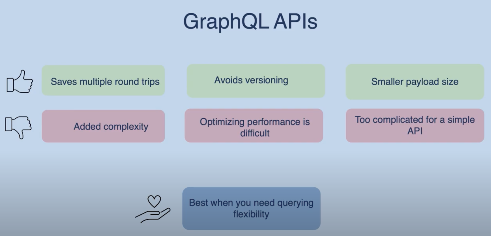

### 11.2 Event Driven API Paradigms

#### **Why do we need Event Driven Architecture?**

* **Use case:** have I got any new msg or not **(@whatsapp)**
* If done with **LONG** **POLLING**(i.e. keep pinging server to check)
  * it'll be huge loss of resources ❌
* So, build your APIs in **Event driven way**

#### There are 3 well known standards for building Pure Event Driven APIs

1. WebHooks
2. WebSockets
3. HTTP Streaming

#### 1.WebHooks:

* the client needs to do **one time registration** with the webhook-provider:
  * Client provides the **interested events** & **callback URL**
    * **Callback URL:** => "hey, when there's an update; send it to me @here"
* When there's a new msg/update; the webhook provider sends the data(usually **POST)**
* <mark style="color:yellow;">**E.G: @Stripe**</mark> webHooks **😎**
* **ISSUES:**
  * Have to handle failures with **retires**
  * Callback URL has to be public => **security** concerns
  * webhooks can be **super noisy**
* **USE CASE:**
  * payments
  * acknowledgements
  * mails

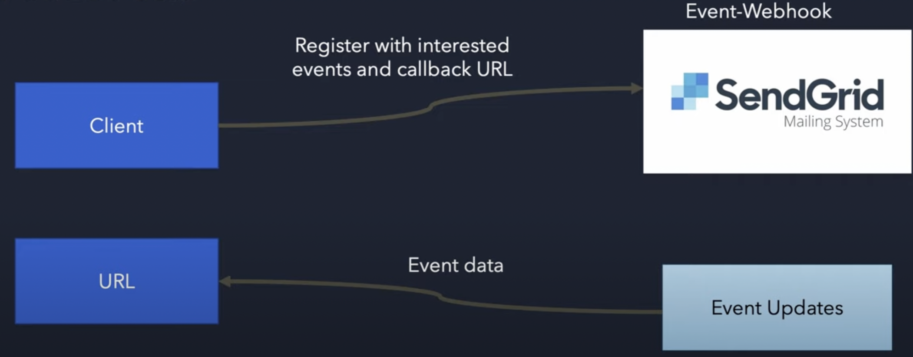

#### 2.WebSockets

* **USE CASE: chatting @whatsapp**
* In the beginning; a **Handshake** connection(usually **HTTP**) is established b/w client & server
* After this; the client & server communicate through a **bi-directional long-lived TCP connection**
* **PROS:**
  * bidirecional low latency communication
  * Reduced overhead of HTTP requests
* **CONS:**
  * Clients are responsible for connections
  * Scalability challanges
* **USE CASES:**
  * chats
  * videocall
  * gaming

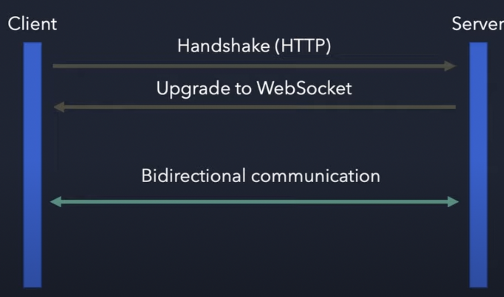

#### 3.HTTP Streaming

* In a normal HTTP response; the server sends a finite, one-time response; right?
* But in here;
  * **client** sends **single request**
  * **server** continues to push data in a **single long lived connection**
* There are 2 ways in which server can do this:
  * **Chunked**: set the response **encoding header to chunked**
    * Good for back-end servers to communicate with each other
  * **Server-sent-events**
    * **ReactJS** 😎
    * **@twitter** : uses this to push new tweets
* **PROS:**
  * Can be done over simple HTTP protocol(no other fancy protocol is reqd)
  * Native browser support
* **CONS:**
  * Bidirectional communication is challenging
  * Buffering

## 12. Microservices: Application layer scaling

### 12.0 Microservices

* Architecture build with group of **loosely coupled** individual services.
* Usually communicate with each other with \*\*REST/RPC \*\*protocol
* all services have their **own database => POLYGLOT ARCHITECTURE(SQL+NoSQL)**
  * **Disadv.** => lots of joins on DB queries
  * **Adv.** => service based horizontal scaling

### 12.1 API Gateway

* \*\*WHY USE? \*\*=> N separate calls to N microservices to get result of 1 query ❌
  * So, use this & make a single call to it
  * API gateway has logic to call which N calls to make.
* **Advantages:**
  * It can make \*\*parallel calls \*\*too, if reqd
  * takes case of auth & filtering etc
  * **SSL termination**
    * verify HTTPS only on call from client to API gateway
    * all internal calls are HTTP/RPC etc
  * **Load Balancing**
  * \*\*Insulation \*\*(sanitation of 3P requests)


### 12.2 Service Discovery

* \*\*WHAT? \*\*=> its a pattern to **identify** the **network addresses** of all of the microservices' instances
* It has a **Service Register.**
  * Give me the list of all network addresses of **Inventory** service's instances(see above ss)
* \*\*Service Discovery => \*\* simply the service which **reads** the **Service Register**
  * **TYPE1 : Client Side Service Discovery:**
    * client talks to **Service Discovery** -> asks the latest addresses of microservices -> use this address to redirected there
  * **TYPE2: Server Side Service Discovery:**
    * client talks to \*\*API Gateway \*\*-> API Gateway asks Service Discovery about the latest addresses of microservices -> use this address to redirected there
* \*\*TOOL: \*\*
  * \*\*@Zookeeper \*\*😎

### 12.3 Misc

* **Varnish**
  * **@ distributed\_cache**
  * Front-end Caching system
  * batching together similar requests from cache to DB
* **Hysterix**
  * **@ api\_management**
  * \=> \*\*usedTo: \*\*avoid **Cascading Failures**
    * graceful degradation
  * circuit breaking
  * health check
  * redirect

1.
   * \=> Hystrix is a\*\* latency and fault tolerance library\*\* designed to isolate points of access to remote systems, services and 3rd party libraries
   * Advantages:
     * Stop cascading failures i.e. reject the request if it cant be handled
     * Realtime **monitoring** of configurations changes
     * Concurrency aware request caching
     * Automated batching through request collapsing
   * IE. If a micro service is failing then return the default response and wait until it recovers.

## 13. Cryptography

* **Src**: [video1](https://www.youtube.com/watch?v=q9vu6\_2r0o4\&ab\_channel=PaulTurner) , [video2](https://www.youtube.com/watch?v=r1nJT63BFQ0\&ab\_channel=HusseinNasser)

#### Two types of Encryption: [SourceVideo](https://www.youtube.com/watch?v=q9vu6\_2r0o4\&ab\_channel=PaulTurner)

1. **Symmetric Encryption**
   * Have\*\* one key\*\* & exchange it **securely** to other party once
   * After exchanging; you encrypt the msg with this key & send it **unsecurely** to other party & they decrypt it with the same key on their side.
   * DISADV:
     * key rotation is difficult
     * single time exchange is prone to error
     * every connection to a new client required generating & maintaining a new key => **Lots of keys to keep track of**
2. **Asymmetric Encryption**
   * Mathematician discovered a set of 2 keys - **{A, B}**; such that:
     * if you encrypt with **A** => you **can** decrypt with **B**
     * if you encrypt with **B** => you **can** decrypt with **A**
     * if you encrypt with **A** => you **CANNOT** decrypt with **A**
     * if you encrypt with **B** => you **CANNOT** decrypt with **B**
   * Call **A: public\_key** and **B:private\_key**
   * <mark style="color:orange;">**Keep private\_key with you**</mark> & <mark style="color:orange;">**share ur public\_key**</mark>** with all your clients(or publish it on site)**
   * Now: the client will **encrypt the msg** with your **public\_key** and will send you.
   * Nobody in the world can understand this msg; because it can only be decrypted by your **private\_key**(which lies safe in your pocket)
   * decrypt the clients's msg with your private\_key and voila!
   * **ISSUE**: **Man in the middle attack**
     * How to solve => use **certificate authority (CA)**

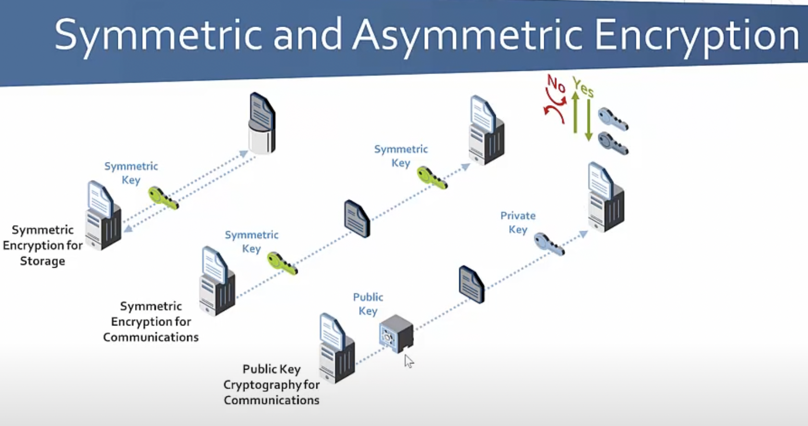

* <mark style="color:orange;">**Certificates**</mark> : to avoid Man in the Middle Attaack in **PKI**(public key infrastructure)
  * **What is Man in the Middle Attack?**
    * Somebody sits b/w the sender & receiver; hearing all the conversation happening
  * **How can Man in the Middle Attack can happen?**
    * **middle\_man** provides their **public\_key** to the **sender**
    * **sender** encrypts data with this middle\_man's public\_key
    * **middle\_man** decrypts data with his **private\_key**
    * **middle\_man** stores a **copy** of this data with him (the bastard!)
    * now he encrypt's data with the original receiver's **public\_key**
    * the original receiver gets the data & decrypts with his **private\_key**
    * to the original receiver; the data looks the same (& there is **no way of him knowing that the call was breached!**)
  * **certificate binds a public\_key to a name**
    * it takes a **public\_key**; **validates** if the key's **owner** is **authenticated** => then **signs it** & adds a **signature** to it
    * has expiration date, issuing authority
  * **How** does certification avoids Man in middle attack? => <mark style="color:orange;">**using SSL/TLS HANDSHAKE**</mark>
    * **Before starting** any **communication** with a client; the **sender** **sends his certificate** to the **client - **<mark style="color:yellow;">**"hey, I want to start sending you some data. Please verify me."**</mark>
    * The **client verifies this certificate** of the sender (using the **signature** attached to certificate)
      * `sign(certificate, private_key) = signature`
      * `verify(certificate, signature, public_key) = True/False`
    * After the client is done verification(also called **Handshake**); the **communication starts**.
  * There are 2 types of handshake protocols:
    * <mark style="color:orange;">**SSL**</mark> : Secure Socket Layer&#x20;
    * <mark style="color:orange;">**TLS**</mark> : Transport Layer Security
      * its the **successor** to SSL
      * its the **latest industry standard** in cryptography

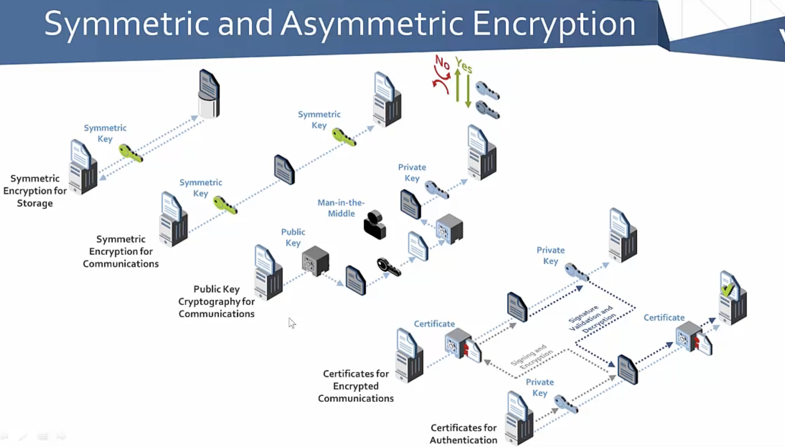

### 12.2 Cryptocurrency | Blockchain

* Resources(Noob level):
  * Nice video: [But how does bitcoin actually work?](https://www.youtube.com/watch?v=bBC-nXj3Ng4\&ab\_channel=3Blue1Brown)
  * John Oliver chacha: [Last Week Tonight](https://www.youtube.com/watch?v=g6iDZspbRMg\&ab\_channel=LastWeekTonight)
* **Main concepts for Noob:**
  * Digital Signature
  * **The ledger is the currency**
  * Decentralize
  * **Proof of Work**
  * **Blockchain**
* **Advance Concepts:**
  * Merkle Trees
  * Alternative to Proof of Work
  * Scripting
  * ............

## 14. Encryption

### 1. MD5

* Faster than SHA256
* Produces **128 bit**
* **More Secure**
* its also a fucking \*\*cryptographic hash function \*\*(see SHA-256 below for details)

### 2. SHA-256

* SHA256 is difficult to handle than MD5 because of its size.
* SHA256 is\*\* less secure than MD5\*\*
* SHA256 takes somewhat more time to calculate than MD5
* Produces **256 bits**
* **Usage:**
  * **encode() :** Converts the string into bytes to be acceptable by hash function.
  * \*\*hexdigest() : \*\*Returns the encoded data in hexadecimal format.
* **WOAH!!!!!!!!!!!**
  * SHA256 is not any common hash\_function, but a fucking **cryptographic hash function**
  * i.e. if `sha256(x) = y`
  * **there is no way to get `x` from `y`** i.e. any function g s.t. `g(y) =x` **doesnt exist!!!!**
  * the only way you can get x from given y is by guessing....probability of guessing =`1/pow(2,256)`
    * Chances of guessing = 1 in 4 Billion for a 40 times olduniverse worth of **1Kilo Google** computers for every fully occupied planet of earth's size 🤣[src: video](https://www.youtube.com/watch?v=S9JGmA5\_unY\&ab\_channel=3Blue1Brown)

```python
import hashlib
  
str = "GeeksforGeeks"
  
result = hashlib.sha256(str.encode())  # need to encode before encrypiton
  
# printing the equivalent hexadecimal value.
print(result.hexdigest())
```

### 3. Base 64

* It takes any form of data and transforms it into a long string of plain text.
* Earlier we can not transfer a large amount of data like files because it is made up of 2⁸ bit bytes but our actual network uses 2⁷ bit bytes
* **base64** uses only **6**-**bits**(2⁶ = 64 characters) to ensure the printable _data_ is _human readable_
* base64 contains:
  * 10 numeric value i.e., 0,1,2,3,…..9.
  * 26 Uppercase alphabets i.e., A,B,C,D,…….Z.
  * 26 Lowercase alphabets i.e., a,b,c,d,……..z.
  * two special characters i.e., +,/. Depends upon your OS.
* Resource: [What Is Base64 Encoding?](https://levelup.gitconnected.com/what-is-base64-encoding-4b5ed1eb58a4)
* **Usage**

```python
from base64 import b64encode
  
s = b'GeeksForGeeks'
gfg = b64encode(s)    #  b’R2Vla3NGb3JHZWVrcw==’
```


## 15. DBs Data Structures: B+Trees & LSMT

There are mainly 2 data structures used in DBMS:

1. **B+Trees =>** used when we want **less search & insertion time** <mark style="color:orange;">**(read heavy systems)**</mark>
2. **LSMT Trees =>** used when we want **low insert & update time** <mark style="color:orange;">**(write heavy systems)**</mark>

### 15.1. B Trees & B+ Trees

* Video: [AbdulBari](https://www.youtube.com/watch?v=aZjYr87r1b8\&t=639s\&ab\_channel=AbdulBari)

#### 15.1.1 B Trees

* B-Tree is a self-balancing search tree
* **Time Complexity of B-Tree:** (<mark style="color:orange;">n</mark> is the total number of elements in the B-tree.)
  * Search: <mark style="color:orange;">`O(logN)`</mark>
  * Insert: <mark style="color:orange;">`O(logN)`</mark>
  * Delete: <mark style="color:orange;">`O(logN)`</mark>
* **Properties of B-Tree:**&#x20;
  * All leaves are at the same level.
  * A B-Tree is defined by the term _<mark style="color:orange;">minimum degree</mark>_ <mark style="color:orange;"></mark><mark style="color:orange;">'t'</mark> .The value of t depends upon disk block size**( i.e. max number of children it can have)**
  * Every node has: (1) child pointer & (2) record pointer

#### 15.1.2 B+ Trees

* <mark style="color:orange;">**USE: In**</mark> <mark style="color:orange;"></mark><mark style="color:orange;">dynamic multilevel indexing of Databases</mark>
* **WHY Dont we use B-Trees in DB?**
  * \=> B-tress have more number of levels -> slow search
  * **in-depth:** The drawback of B-tree used for indexing, however is that <mark style="color:yellow;">it stores the data pointer</mark> (a pointer to the disk file block containing the key value), corresponding to a particular key value, along with that key value <mark style="color:yellow;">in the node of a B-tree</mark>. This technique, greatly reduces the number of entries that can be packed into a node of a B-tree, thereby contributing to the <mark style="color:yellow;">increase in the number of levels in the B-tree, hence increasing the search time of a record.</mark>
  * <mark style="color:yellow;">B+ tree eliminates the above drawback by storing data pointers only at the leaf nodes of the tree.</mark>&#x20;
*   **Diff b/w B Trees & B+ Trees:**

    * **=>** In B+ trees  only leaf nodes have record pointer
    * \=> While in B trees; all nodes will have child pointer+record pointer


### 15.2. LSMT Tree : Optimizing writes in DB

* <mark style="color:yellow;">**LSMT =**</mark> <mark style="color:yellow;"></mark><mark style="color:yellow;">Log Structured Merged Tree</mark>
* link: [youtube](https://www.youtube.com/watch?v=oUNjDHYFES8\&ab\_channel=GLTechTutorials)
* **Advantages:**
  * High write throughput
  * Attractive to store data with high update rates
  * Minimizes store overhead
* **Disadvantages:**
  * Slow reads
  * "Compaction" process sometimes interrupts with read & write operations on disk
* **HOW Does it's structure look like?**
  * \=> it comprises of tree-like data structure with 2 levels:
    * <mark style="color:orange;">**Memtable**</mark> : resides in-memory
    * <mark style="color:orange;">**SSTable**</mark> : resides on hard-disk
* **WHERE Does LSMT get used?**
  * \=> mostly in all types of DBs ( in key-val **DBs/ cassandra/ MongoDB/**pulsar etc)
* LSMT uses these 3 concepts to optimize reads & writes:
  * SSTables
  * Memtable
  * Compaction
  * Bloom Filters

#### 15.2.1.  LSMT@First Concept:: <mark style="color:orange;">SSTables</mark>: Sorted String Tables

* \=> it's a special type of data structure ( based on linked-list & sorted array)
* Insert Complexity: <mark style="color:orange;">**O(1)**</mark>
* Search Complexity: <mark style="color:orange;">**O(logN)**</mark>
* **NOTE:** once you've written a value to a SStable, its persisted forever <mark style="color:orange;">**(i.e. SSTables are immutable)**</mark>


#### 15.2.1.  LSMT@2nd Concept:: <mark style="color:orange;">Memtable</mark>

* <mark style="color:orange;">A bad</mark> option for sending write/update queries to DB => send then <mark style="color:orange;">one by one</mark>
* <mark style="color:orange;">A better</mark> option for write( right-side in pic below): bunch them together & send them in <mark style="color:orange;">batch</mark>
* This additional data-structure to batch up the queries is called <mark style="color:orange;">**Memtable**</mark>
* **Advantages:**&#x20;
  * single acknowledgment is reqd from DB ( ki push ho gya hai)
  * ... show in pic(right-side ) below


* <mark style="color:orange;">**Write Operations:**</mark>
  * values are batched in (immutable) SSTables data structure- to be stored (in-memory) Memtable
  * Once the max capacity of Memtable is reached; the SSTable is pushed to DB (on-disk)
  * **handling duplicate keys( "Walter" below):**
    * since SSTables are immutable; we store both values
    * these SSTables are persisted with their insertion-<mark style="color:orange;">timestamps</mark> <mark style="color:orange;"></mark><mark style="color:orange;">****</mark>&#x20;
    * while read: the value with latest timestamp is returned( see **Bloom-filter** below)


* <mark style="color:orange;">**Read Operations:**</mark>
  * STEP#1: check if value is present in Memtable itself
  * STEP#2: search in all SSTables( using Bloomfilters)

.png>)

#### 15.2.3.  LSMT@3rd Concept:: <mark style="color:orange;">Compaction</mark>

* <mark style="color:orange;">**The WHY:**</mark>&#x20;
  * Worst case read time from disk  = <mark style="color:orange;">`O(NlogT)`</mark>where <mark style="color:orange;">N</mark> is the number of SSTables & <mark style="color:orange;">T =</mark> size of one SSTable
  * As number of SSTables increase on disk:
    * read time increases ❌
    * duplication of keys also increase ❌
* <mark style="color:orange;">**The WHAT:**</mark>&#x20;
  * Compaction is basically **a **<mark style="color:red;">**daemon-cron job**</mark> which runs in background (in every 30 mins or so) to <mark style="color:orange;">**merge SSTables**</mark> by:&#x20;
    * removing redundant/deleted keys
    * resolving duplicate keys(to latest val)
    * Hence; creating new compacted/merged SStables

.png>)


#### 15.2.4.  LSMT@4th Concept:: <mark style="color:orange;">Bloom Filters</mark>

* <mark style="color:orange;">**The WHY:**</mark>&#x20;
  * as number of SStables increase on disk => read latency also increases
* <mark style="color:orange;">**The WHAT:**</mark>&#x20;
  * Wa filter associated with a SSTable, which **probabilistically** tells you if a key is present in that SSTable or not
  * BloomFilter function for key K in SStable: <mark style="color:orange;">`bloom_filter(k)-> {0 or 1}`</mark>&#x20;
    * If output == 0 => key `k` is definitely not present in the table
    * if output == 1 => key `k` can be or cannot be present in that sstable
      * as bloom filters (though can be optimised to 99.9% too) can still give **false-positive** results
      * to verify; you need to search in that table
* \=> so now(after applying bloom filter): search complexity = <mark style="color:orange;">O(MlogT)</mark>; where **M = number of tables where bloom\_filter(key=k) == 1 &** T = SSTable Size
  * ofc: <mark style="color:orange;">**M << N**</mark> (as written above in search complexity without bloom-filter)


## 16. Quad Trees



```python
import numpy as np
import math

class Point:
    def __init__(self, x, y):
        self.x = x
        self.y = y
    
    def distanceToCenter(self, center):
        return math.sqrt((center.x-self.x)**2 + (center.y-self.y)**2)

class Rectangle:
    def __init__(self, center, width, height):
        self.center = center
        self.width = width
        self.height = height
        self.west = center.x - width
        self.east = center.x + width
        self.north = center.y - height
        self.south = center.y + height

    def containsPoint(self, point):
        return (self.west <= point.x < self.east and 
                self.north <= point.y < self.south)
    
    def intersects(self, range):
        return not (range.west > self.east or
                    range.east < self.west or
                    range.north > self.south or
                    range.south < self.north)
    

    def draw(self, ax, c='k', lw=1, **kwargs):
        x1, y1 = self.west, self.north
        x2, y2 = self.east, self.south
        ax.plot([x1,x2,x2,x1,x1], [y1,y1,y2,y2,y1], c=c, lw=lw, **kwargs)

class QuadTree:
    def __init__(self, boundary, capacity = 4):
        self.boundary = boundary
        self.capacity = capacity
        self.points = []
        self.divided = False

    def insert(self, point):
        # if the point is in the range of current quadTree
        if not self.boundary.containsPoint(point):
            return False
        
        # if has not reached capcaity
        if len(self.points) < self.capacity:
            self.points.append(point)
            return True
        
        if not self.divided:
            self.divide()

        if self.nw.insert(point):
            return True
        elif self.ne.insert(point):
            return True
        elif self.sw.insert(point):
            return True
        elif self.se.insert(point):
            return True

        return False
    
    def queryRange(self, range):
        found_points = []

        if not self.boundary.intersects(range):
            return []
        
        for point in self.points:
            if range.containsPoint(point):
                found_points.append(point)
        
        if self.divided:
            found_points.extend(self.nw.queryRange(range))
            found_points.extend(self.ne.queryRange(range))
            found_points.extend(self.sw.queryRange(range))
            found_points.extend(self.se.queryRange(range))
        
        return found_points
    
    def queryRadius(self, range, center):
        found_points = []

        if not self.boundary.intersects(range):
            return []
        
        for point in self.points:
            if range.containsPoint(point) and point.distanceToCenter(center) <= range.width:
                found_points.append(point)
        
        if self.divided:
            found_points.extend(self.nw.queryRadius(range, center))
            found_points.extend(self.ne.queryRadius(range, center))
            found_points.extend(self.sw.queryRadius(range, center))
            found_points.extend(self.se.queryRadius(range, center))
        
        return found_points

    def divide(self):
        center_x = self.boundary.center.x
        center_y = self.boundary.center.y
        new_width = self.boundary.width / 2
        new_height = self.boundary.height / 2

        nw = Rectangle(Point(center_x - new_width, center_y - new_height), new_width, new_height)
        self.nw = QuadTree(nw)

        ne = Rectangle(Point(center_x + new_width, center_y - new_height), new_width, new_height)
        self.ne = QuadTree(ne)

        sw = Rectangle(Point(center_x - new_width, center_y + new_height), new_width, new_height)
        self.sw = QuadTree(sw)

        se = Rectangle(Point(center_x + new_width, center_y + new_height), new_width, new_height)
        self.se = QuadTree(se)

        self.divided = True

    def __len__(self):
        count = len(self.points)
        if self.divided:
            count += len(self.nw) + len(self.ne) + len(self.sw) + len(self.se) 
        
        return count
    
    def draw(self, ax):
        self.boundary.draw(ax)

        if self.divided:
            self.nw.draw(ax)
            self.ne.draw(ax)
            self.se.draw(ax)
            self.sw.draw(ax)
```



```python
import numpy as np
import matplotlib.pyplot as plt
from matplotlib import gridspec
from quadtree import Point, Rectangle, QuadTree

DPI = 72

width, height = 600, 400

N = 1000
xs = np.random.rand(N) * width
ys = np.random.rand(N) * height
points = [Point(xs[i], ys[i]) for i in range(N)]

domain = Rectangle(Point(width/2, height/2), width/2, height/2)
qtree = QuadTree(domain)

for point in points:
    qtree.insert(point)

print('Total points: ', len(qtree))

# draw rectangles
fig = plt.figure(figsize=(700/DPI, 500/DPI), dpi=DPI)
ax = plt.subplot()
ax.set_xlim(0, width)
ax.set_ylim(0, height)
qtree.draw(ax)

# draw points
ax.scatter([p.x for p in points], [p.y for p in points], s=4)
ax.set_xticks([])
ax.set_yticks([])

# generate the range
#center_x = np.random.rand() * width
#center_y = np.random.rand() * height
center_x = 300
center_y = 200

range_width = np.random.rand() * min(center_x, width - center_x)
range_height = np.random.rand() * min(center_y, height - center_y)

found_points = []
#range = Rectangle(Point(center_x, center_y), range_width, range_height)
#found_points = qtree.queryRange(range)
#radius = min(range_width, range_height)
radius = 150
range = Rectangle(Point(center_x, center_y), radius, radius)
found_points = qtree.queryRadius(range, Point(center_x, center_y))

print('points in range:', len(found_points))

ax.scatter([p.x for p in found_points], [p.y for p in found_points],
            facecolors='none', edgecolors='r', s=32)

range.draw(ax, c='r', lw=2)

ax.invert_yaxis()
plt.tight_layout()
plt.savefig('search-quadtree.png', DPI=72)
plt.show()
```







## 17. Numbers Developers Should Know

### 17.1 Memory Size Numbers


### 17.2 Memory Access SLAs


### 17.3 Access Time Comparison

scale is no the actual time taken, but to make humans understand the diff in times

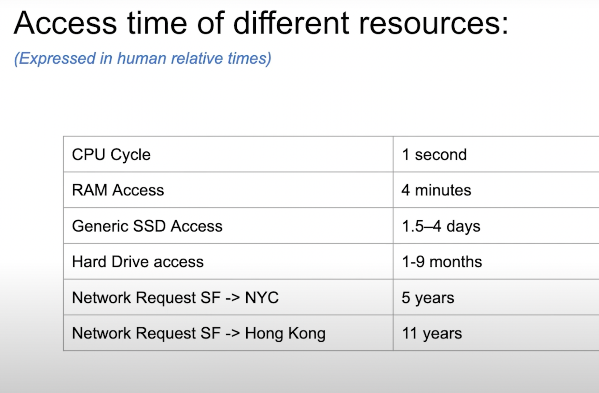

## 18. Estimations Numbers

* `b` => bytes
* if table size = 60 bytes
  * If total users = 500M&#x20;
  * <mark style="color:orange;">**=>**</mark> we will need 60b\*500M = 30,000(b\*M) <mark style="color:orange;">=> 30GB</mark>
  * <mark style="color:orange;">"30 million bytes means 30 MB"</mark>

| Field Type            |                                                                                         |   |
| --------------------- | --------------------------------------------------------------------------------------- | - |
| IDs                   | <ul><li><p>if int -> 4 bytes   (32 bit)</p><p>if uuid -> 8 bytes (64 bit)</p></li></ul> |   |
| Dates & Timestamps    | datetime ->  4 b                                                                        |   |
| Name                  | 20 b                                                                                    |   |
| Email                 | 32 b                                                                                    |   |
| URI path (media link) | 256 b                                                                                   |   |
| Lat \| Long           | 4 b                                                                                     |   |
| Photo                 | 200KB                                                                                   |   |
| Video                 | 2MB                                                                                     |   |


\*\*\*\*\*\*\*\*\*\*\*\*\*\*\*\*\*\*\*\*\*\*\*\*\*\*\*\*\*\*\*\*\*\*\*\*\*\*\*\*\*\*\*\*\*\*\*\*\*\*\*\*\*\*\*\*\*\*\*\*\*\*\*\*\*\*\*\*\*\*\*\*\*\*\*\*\*\*\*\*\*\*\*\*\*\*\*\*\*\*\*\*

## Resources:

* Whimsical board: [HLDs](https://whimsical.com/hlds-n52ahnNWNwnC99fzGKJQ4)
* \*\*NOTE: \*\*[**SYSTEM DESIGN TEMPLATE ON LEETCODE**](https://leetcode.com/discuss/career/229177/My-System-Design-Template)

## TODOs:

* [ ] Understand how authentication+authorisation works? with code+cookies+session+ssl+3P
* [ ] Read-up **Designing data intensive applications** book
* [x] Learn concepts from Grokking the SysD interview(Part-2)
* [x] Finish System Design Primer in-depth
* [x] Start doing questions:
  * [x] Grokking SysD Part I
  * [x] Youtube
  * [ ] Leetcode
* [x] Revise all the things learnt during React & NextJS
* [ ] Learn all about Big Data Techs using currently @fk
* [ ] For all the concepts of HLD; see the actual code(hands on) & have an implement ready for each.
* [ ] Scan through all the major blogs of tech-companies'
* [x] Concurrency - with code(py/java) : https://tutorialedge.net/course/python/
* [x] Consistent Hashing
* [ ] OSI Model
* [x] HTTPS
* [x] SSL + encryption(pub key vs private key)
* [x] Hash algos: SHA-256, RSA
* [x] cryptography **@CoinBase** 💲
